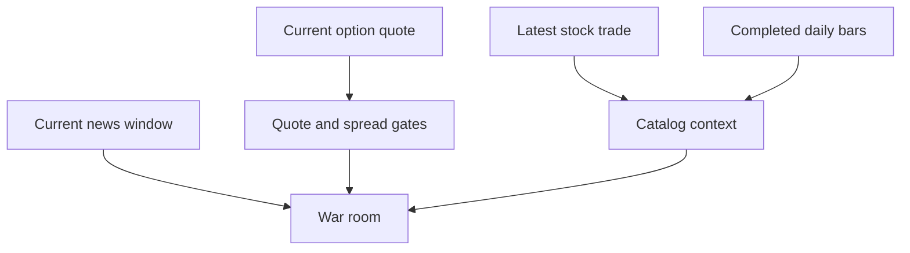

# Market-Data Policy

The runtime reads current Alpaca paper-market data. It does not import stored market pages
into SQLite. Completed daily bars can provide short return context, but the current option
quote controls trade admission and price.



```csharp
if (!contract.IsTradeableQuote || contract.Ask is null)
{
    return RiskVerdict.Reject("a valid two-sided quote is required");
}
```

## Invariants

- A missing, one-sided, crossed, stale, or wide quote cannot open a position.
- The ask sets the limit price and premium risk.
- The runtime does not substitute a daily close for a missing quote.
- The application does not name an Alpaca feed. Account entitlement selects the feed.
- A partial option-chain read excludes that underlying for the cycle.

## Related lodes

- [Contract catalog](../trading/tradeable-contract-catalog.md)
- [Risk guardrails](../trading/risk-guardrails.md)
- [Alpaca summary](summary.md)
- [Historical model evidence](../research/historical-model-evidence.md)
