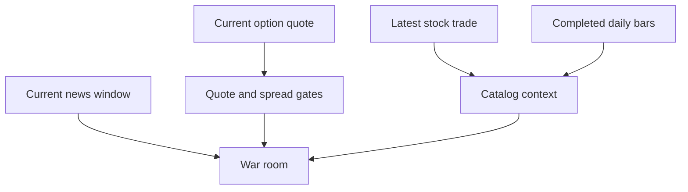

# Market-Data Policy

The runtime reads current Alpaca paper-market data. It does not import stored market pages
into SQLite. Completed daily bars provide short return context. The current option quote
controls trade admission and price.



```csharp
if (!contract.IsTradeableQuote || contract.Ask is null)
{
    return RiskVerdict.Reject("a valid two-sided quote is required");
}
```

## Invariants

- A missing, one-sided, crossed, stale, or wide quote cannot open a position.
- The ask sets the limit price and premium risk.
- The runtime does not substitute a daily close for a missing quote.
- Each stock request names the IEX feed. This prevents an unplanned SIP request.
- Each option-chain request names the Indicative feed. This prevents an unplanned OPRA request.
- A partial option-chain read excludes that underlying for the cycle.
- The live gateway requests 1,000 option rows per page and follows every page token.
- Missing delta or implied volatility does not reject a contract. These fields are optional
  research metadata.

```csharp
var stock = new LatestMarketDataRequest(symbol) { Feed = MarketDataFeed.Iex };
var options = new OptionChainRequest(symbol) { OptionsFeed = OptionsFeed.Indicative };
```

## Related lodes

- [Trading summary](../trading/summary.md)
- [Risk guardrails](../trading/risk-guardrails.md)
- [Alpaca summary](summary.md)
- [Research summary](../research/summary.md)
