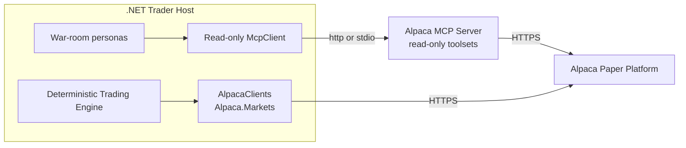
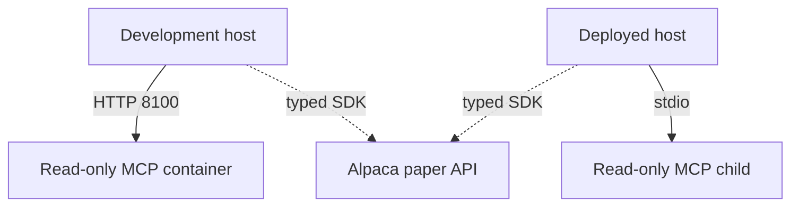
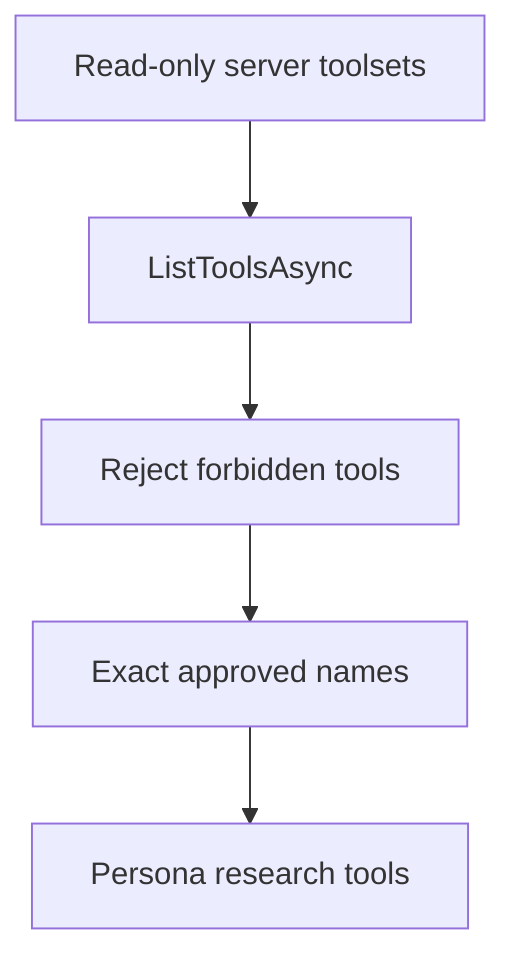

# Alpaca Integration

The system reaches Alpaca two ways, split by **caller**, not by protocol (ADR-001).



| Caller | Path | Reaches |
|---|---|---|
| War-room personas | Read-only MCP, filtered by `McpToolCatalog` | bars, exact-option data, news, greeks, market context |
| Deterministic C# | `Alpaca.Markets` SDK | account, positions, orders, market data, option chains |

**There is no trading MCP connection.** No MCP server this host runs holds an order tool, so
there is no toolset split that a server upgrade could widen. See ADR-006.

## Why the SDK for deterministic code

MCP returns text shaped for a model to read. Parsing that in money code is where fail-closed
defects hide: a missing bid that silently becomes `0m` is a defect no test catches until it
costs money.

`Alpaca.Markets` returns `IAccount`, `IOrder`, `IOptionSnapshot`, `IQuote` and `IGreeks`
already typed, with `decimal` prices and nullable fields for genuinely absent values. The whole
validation layer collapses to a null check at the call site:

```csharp
request.Pagination.Size = 1_000;
do
{
    var page = await options.GetOptionChainAsync(request, cancellationToken);
    contracts.AddRange(Map(page.Items));
    request.Pagination.Token = page.NextPageToken;
}
while (!string.IsNullOrWhiteSpace(request.Pagination.Token));
```

Only deterministic C# reads option chains. An agent can inspect an exact contract through
MCP, but it cannot use MCP to rediscover the chain. See
[trading summary](../trading/summary.md).

## The clients

`Alpaca/AlpacaClients.cs` holds three, all built from `Environments.Paper`:

| Client | Use |
|---|---|
| `IAlpacaTradingClient` | account, clock, positions, orders. The only write path. |
| `IAlpacaDataClient` | stock bars, quotes, trades, snapshots |
| `IAlpacaOptionsDataClient` | `OptionChainRequest`, snapshots, quotes, greeks |

**`Environments.Paper` is a compile-time guarantee.** No configuration value, environment
variable, or argument can move the process to a live account; it takes a source edit. A unit
test pins it.

The typed SDK gateway sets `MarketDataFeed.Iex` on stock requests. It sets
`OptionsFeed.Indicative` on option-chain requests. The runtime does not depend on an account
default because that default can select data that the account cannot read.

## MCP run modes

There is one Alpaca MCP server and it is read-only.

| Mode | Transport | Owner | Lifetime |
|---|---|---|---|
| Development | Streamable HTTP at `127.0.0.1:8100/mcp` | `compose.dev.yaml` | Stays up across host runs. |
| Deployed | `stdio` | The .NET host | One child process for the host lifetime. |



`Alpaca__Mcp__ReadOnlyUrl` selects HTTP. `Alpaca__Mcp__ServerCommand` selects `stdio`.
Both values together, or neither value, stop startup. `ALPACA_TOOLSETS` is:

```text
assets,stock-data,options-data,news,corporate-actions
```

The development port binds to loopback only. The deployed image contains the pinned server,
so it does not need a Docker socket.

## Order identity and idempotency

`NewOrderRequest.ClientOrderId` carries the idempotency key, and
`GetOrderAsync(string clientOrderId, ct)` reads the order back by it. A missing order raises
`RestClientErrorException` rather than returning null, so the not-found case is a `catch`.

The order of operations is fixed:

1. Check the store for the client order id. **If it is already reserved, resolve that order.**
2. Only if it is new: select the contract, write the `orders` row, then submit.

Selecting a contract first and checking second defeats the guard: a re-run after a crash would
pick a fresh contract at a new price instead of resolving the order that may already exist.

## Research tool integration

At startup the host connects the read-only MCP client, lists the tools, logs every discovered
name, asserts none can reach the account, and keeps the approved subset for the agents.

```csharp
var discovered = await client.ListToolsAsync(cancellationToken: ct);
McpToolCatalog.AssertNoForbiddenTool(discovered);
var approved = discovered.Where(McpToolCatalog.IsApprovedResearchTool).ToArray();
```

The approved set becomes `ChatOptions.Tools`. `McpClientTool` derives from `AIFunction`, so no
adapter is needed. **Never pass the discovered list unfiltered** — that would delete control 2.

## Safety controls

The server-side toolset and the client-side exact allowlist are independent controls.
`McpToolCatalog.AssertNoForbiddenTool` stops startup if the server exposes account, position,
order, exercise, file, shell, or secret access.



The server receives paper credentials through environment variables. Models never receive
the credentials. The typed SDK is fixed to `Environments.Paper`. An MCP connection failure
stops normal MCP-enabled startup; `--no-mcp` is the explicit mode that removes Alpaca research
tools.

Each model tool request and result is written to `agent_tool_calls`. A model-generated value
never becomes a shell command or a broker-tool argument.

## Current repository state

| Item | State |
|---|---|
| `external/alpaca-mcp-server` | Submodule at commit `872abbf`, package version `2.3.0`. `serverInfo.version` reports `3.1.0`; log both. |
| `compose.dev.yaml` | One service, `noidea-mcp-readonly`, on `127.0.0.1:8100`. |
| `src/Xakpc.Alpaca.NøIdea/Dockerfile` | Holds the server and the .NET host. One stdio child. |
| `Alpaca/AlpacaClients.cs` | Written. Three typed clients on `Environments.Paper`. |
| `Alpaca/AlpacaMcpClient.cs`, `McpToolCatalog.cs` | Written. The measured server exposes 34 tools; the host approves 23. |
| `Storage/Schema.sql` | Eight tables for audit evidence and restart state. |
| MCP diagnostic | `alpaca-mcp.http` does not exist. Use `--check-mcp`. |

## Related

- [Market data policy](market-data-policy.md)
- [LLM summary](../llm/summary.md)
- [Local development](../operations/local-development.md)
- [Risk guardrails](../trading/risk-guardrails.md)
