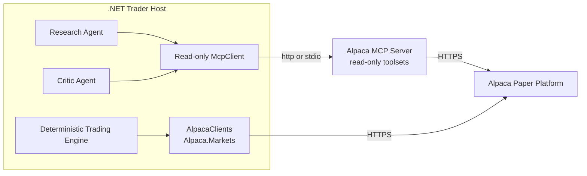

# Alpaca Integration

The system reaches Alpaca two ways, split by **caller**, not by protocol (ADR-001).



| Caller | Path | Reaches |
|---|---|---|
| Research Agent, Critic Agent | Read-only MCP, filtered by `McpToolCatalog` | bars, quotes, news, option chains, greeks |
| Deterministic C# | `Alpaca.Markets` SDK | account, positions, orders, market data, option chains |

**There is no trading MCP connection.** No MCP server this host runs holds an order tool, so
there is no toolset split that a server upgrade could widen. See ADR-006.

## Why the SDK for deterministic code

MCP returns text shaped for a model to read. Parsing that in money code is where fail-closed
defects hide: a missing bid that silently becomes `0m` is a defect no test catches until it
costs money.

`Alpaca.Markets` returns `IAccount`, `IOrder`, `IOptionSnapshot`, `IQuote` and `IGreeks`
already typed, with `decimal` prices and nullable fields for genuinely absent values. The whole
validation layer collapses to a null check at the call site:

```csharp
var candidate = chain.Items
    .Where(entry => entry.Value.Quote is { BidPrice: > 0, AskPrice: > 0 })
    .Where(entry => entry.Value.Quote!.AskPrice >= entry.Value.Quote.BidPrice)
    .OrderBy(entry => entry.Value.Quote!.AskPrice - entry.Value.Quote.BidPrice)
    .FirstOrDefault();
```

## The clients

`Alpaca/AlpacaClients.cs` holds three, all built from `Environments.Paper`:

| Client | Use |
|---|---|
| `IAlpacaTradingClient` | account, clock, positions, orders. The only write path. |
| `IAlpacaDataClient` | stock bars, quotes, trades, snapshots |
| `IAlpacaOptionsDataClient` | `OptionChainRequest`, snapshots, quotes, greeks |

**`Environments.Paper` is a compile-time guarantee.** No configuration value, environment
variable, or argument can move the process to a live account; it takes a source edit. A unit
test pins it.

Pass no market-data feed anywhere (ADR-010). `OptionChainRequest.OptionsFeed` exists and must
stay unset, so the account default applies.

## Order identity and idempotency

`NewOrderRequest.ClientOrderId` carries the idempotency key, and
`GetOrderAsync(string clientOrderId, ct)` reads the order back by it. A missing order raises
`RestClientErrorException` rather than returning null, so the not-found case is a `catch`.

The order of operations is fixed:

1. Check the store for the client order id. **If it is already reserved, resolve that order.**
2. Only if it is new: select the contract, write the `orders` row, then submit.

Selecting a contract first and checking second defeats the guard: a re-run after a crash would
pick a fresh contract at a new price instead of resolving the order that may already exist.

## Research tool integration

At startup the host connects the read-only MCP client, lists the tools, logs every discovered
name, asserts none can reach the account, and keeps the approved subset for the agents.

```csharp
var discovered = await client.ListToolsAsync(cancellationToken: ct);
McpToolCatalog.AssertNoForbiddenTool(discovered);
var approved = discovered.Where(McpToolCatalog.IsApprovedResearchTool).ToArray();
```

The approved set becomes `ChatOptions.Tools`. `McpClientTool` derives from `AIFunction`, so no
adapter is needed. **Never pass the discovered list unfiltered** — that would delete control 2.

## Current repository state

| Item | State |
|---|---|
| `external/alpaca-mcp-server` | Submodule at commit `872abbf`, package version `2.3.0`. `serverInfo.version` reports `3.1.0`; log both. |
| `compose.dev.yaml` | One service, `noidea-mcp-readonly`, on `127.0.0.1:8100`. |
| `src/Xakpc.Alpaca.NøIdea/Dockerfile` | Holds the server and the .NET host. One stdio child. |
| `Alpaca/AlpacaClients.cs` | Written. Three typed clients on `Environments.Paper`. |
| `Alpaca/AlpacaMcpClient.cs`, `McpToolCatalog.cs` | Written. 34 tools discovered, 25 approved. |
| `Storage/TradingStore.cs` | Written. `orders` table only. |
| `alpaca-mcp.http` | **Does not exist.** Earlier lode revisions claimed it did. Use `--check-mcp`. |

## Related

- [MCP safety](mcp-safety.md)
- [Market data policy](market-data-policy.md)
- [LLM tool policy](../llm/tool-policy.md)
- [Risk guardrails](../trading/risk-guardrails.md)
