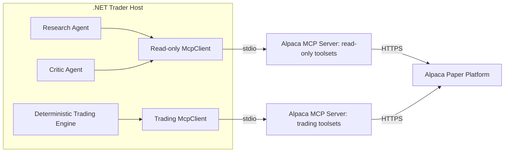

# Alpaca MCP Integration

The system reaches Alpaca through the **Alpaca MCP server** (ADR-001). It does not use the
Alpaca CLI. It does not call the Alpaca REST API directly.

## Why MCP

- The C# MCP SDK (`ModelContextProtocol`) manages the client connection.
- `Microsoft.Extensions.AI` can put MCP tools into `ChatOptions.Tools` directly.
- The Research Agent and the Critic Agent get Alpaca data tools without a custom C# wrapper
  for each data operation.
- One connection stays open for many calls. No process starts for each operation.
- Deterministic C# can use a separate connection for account and order actions.
- The server toolset selection can keep the LLM read-only.

## Confirmed option capabilities

The hackathon FAQ confirms that the official Alpaca MCP server can:

```text
Fetch option contracts
Fetch option chains
Retrieve option quotes
Retrieve option Greeks
Place single-leg option orders
Place multi-leg option orders
```

Supported option order types through MCP:

| Type | Options |
|---|---|
| Market | Yes |
| Limit | Yes |
| Stop | Yes |
| Stop-limit | Yes |
| Trailing stop | **No.** Alpaca supports trailing stops for stocks, not options. |

**The strategy must not depend on a trailing-stop option order.** A stop-loss exit must use
a stop, a stop-limit, or a Position Manager check that submits a market or limit close
order.

## Two connections

The host creates **two** MCP clients and **two** MCP server instances.



| Connection | User | Toolsets |
|---|---|---|
| Read-only | Research Agent, Critic Agent, `IMarketDataGateway` | Bars, quotes, news, option chains, option snapshots, Greeks, asset metadata |
| Trading | `ITradingGateway` only | Account, positions, orders, option order submission, cancel, close |

**The read-only server instance must not receive a trading toolset.** The trading tools are
never added to an LLM tool list. See [MCP safety](mcp-safety.md).

## Server deployment

The Alpaca MCP server is a **local dependency**. The repository holds it as a git submodule
and runs it in Docker.

```bash
git submodule add https://github.com/alpacahq/alpaca-mcp-server external/alpaca-mcp-server
docker build -t mcp/alpaca:<pinned-tag> external/alpaca-mcp-server
```

The .NET host starts each server instance as a child process with `StdioClientTransport`.
The child process is the `docker run` command. Docker passes the container standard input
and standard output to the transport.

```text
docker run -i --rm \
  -e ALPACA_API_KEY=... \
  -e ALPACA_SECRET_KEY=... \
  -e ALPACA_PAPER_TRADE=true \
  mcp/alpaca:<pinned-tag>
```

Rules:

- Use `-i`. The transport needs standard input.
- Use `--rm`. A stopped cycle must not leave containers.
- **Pin the image tag and the submodule commit** (ADR-011). Do not upgrade during the
  official trading window.
- Pass credentials as environment variables. Do not write them to disk.
- Start the process with `ProcessStartInfo` and `ArgumentList`. Never build one command
  string. Never use a shell.

The exact server flag that selects the toolset comes from the pinned server version. The
host must confirm the selection with `ListToolsAsync()` at startup.

## Research tool integration

At startup:

1. Start the read-only server.
2. Connect with `McpClient`.
3. Call `ListToolsAsync()`.
4. Filter the result with the approved allowlist.
5. Add the approved tools to `ChatOptions.Tools` for both LLM agents.

```csharp
var readOnlyMcp = await McpClient.CreateAsync(readOnlyTransport, cancellationToken: ct);

var approvedTools = (await readOnlyMcp.ListToolsAsync(cancellationToken: ct))
    .Where(McpToolCatalog.IsApprovedResearchTool)
    .ToArray();

var chatOptions = new ChatOptions { Tools = [.. approvedTools] };
```

The exact API can change with the package version. The requirement does not change:

> The LLM receives only approved read-only Alpaca MCP tools.

## Two typed gateways

Strategy code must not depend on an MCP tool name or on a raw MCP result object. Two typed
facades hold that knowledge.

```csharp
public interface IMarketDataGateway
{
    Task<IReadOnlyList<Bar>> GetBarsAsync(
        string symbol, TimeFrame timeframe,
        DateTimeOffset from, DateTimeOffset to, CancellationToken ct);

    Task<IReadOnlyList<NewsItem>> GetNewsAsync(
        string symbol, DateTimeOffset from, CancellationToken ct);

    Task<OptionChain> GetOptionChainAsync(string symbol, CancellationToken ct);
}

public interface ITradingGateway
{
    Task<AccountSnapshot> GetAccountAsync(CancellationToken ct);
    Task<MarketClock> GetClockAsync(CancellationToken ct);
    Task<IReadOnlyList<Position>> GetPositionsAsync(CancellationToken ct);
    Task<IReadOnlyList<Order>> GetOpenOrdersAsync(CancellationToken ct);

    Task<OrderResult> SubmitOptionOrderAsync(OptionOrderRequest request, CancellationToken ct);
    Task<OrderResult> CancelOrderAsync(string orderId, CancellationToken ct);
    Task<OrderResult> ClosePositionAsync(string optionSymbol, CancellationToken ct);
}
```

| Interface | Live | Replay |
|---|---|---|
| `IMarketDataGateway` | `AlpacaMcpMarketDataGateway` | `ReplayMarketDataGateway` |
| `ITradingGateway` | `AlpacaMcpTradingGateway` | `ReplayTradingGateway` |

The Research Agent does not use `ITradingGateway`. The LLM agents use the discovered MCP
tools directly. The deterministic ML code and the Options Evaluator use
`IMarketDataGateway`, because they need stable typed data structures.

## Current repository state

The submodule and the Docker image do not exist yet. Phase 1 of the
[MVP roadmap](../plans/mvp-roadmap.md) creates them. The folder
`cli_0.0.14_windows_amd64/` still holds the old Alpaca CLI binary. The CLI is a fallback
only. No code may call it.

## Related

- [MCP safety](mcp-safety.md)
- [Market data policy](market-data-policy.md)
- [LLM tool policy](../llm/tool-policy.md)
- [Risk guardrails](../trading/risk-guardrails.md)
