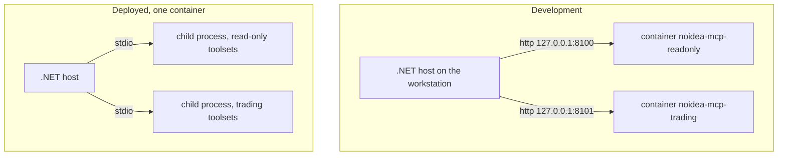

# Alpaca MCP Run Modes

The same pinned Alpaca MCP server runs in two ways. This file holds the details of both.

## The two modes

ADR-012 keeps both modes.

| Mode | Transport | Who starts the server | Lifetime |
|---|---|---|---|
| Development | `streamable-http` | `docker compose -f compose.dev.yaml up -d` | Permanent. It stays up across debug runs. |
| Deployed | `stdio` | The .NET host, as two child processes | The host owns it and stops it at shutdown. |



### Development

`compose.dev.yaml` runs two containers from `docker/alpaca-mcp.dev.Dockerfile`. The ports
bind to `127.0.0.1` only, because the servers have no authentication. The full procedure is
in [local development](../operations/local-development.md).

### Deployed

`src/Xakpc.Alpaca.NøIdea/Dockerfile` puts the server **inside the application image**:

```text
/opt/python           managed CPython 3.11, installed by uv
/opt/alpaca-mcp       the pinned submodule and its virtual environment
```

A container cannot start a sibling container without the Docker socket. The image therefore
holds the server, and no `docker run` happens at run time. The host starts each child with
`ProcessStartInfo` and `ArgumentList`:

```text
/opt/alpaca-mcp/.venv/bin/alpaca-mcp-server --transport stdio
```

Each child gets a different `ALPACA_TOOLSETS` value in its environment.

### The toolset split

`ALPACA_TOOLSETS` selects the tool groups. It is the server-side control of
[MCP safety](mcp-safety.md).

| Connection | `ALPACA_TOOLSETS` |
|---|---|
| Read-only | `assets,stock-data,options-data,news,corporate-actions` |
| Trading | `account,trading,assets` |

`assets` is on both connections. It holds the market clock, the calendar, and the option
contract metadata. `account` and `trading` must never reach the read-only connection.

### Configuration keys

| Key | Development | Deployed |
|---|---|---|
| `Alpaca:Mcp:ReadOnlyUrl` | `http://127.0.0.1:8100/mcp` | not set |
| `Alpaca:Mcp:TradingUrl` | `http://127.0.0.1:8101/mcp` | not set |
| `Alpaca:Mcp:ServerCommand` | not set | `/opt/alpaca-mcp/.venv/bin/alpaca-mcp-server` |

A URL selects the HTTP transport. A command selects `StdioClientTransport`. Both together, or
neither, is a startup failure.

### Rules

- **Pin the image tag and the submodule commit** (ADR-011). Do not upgrade during the
  official trading window.
- Pass credentials as environment variables. Do not write them to disk.
- Start a child process with `ProcessStartInfo` and `ArgumentList`. Never build one command
  string. Never use a shell.
- Never publish a development MCP port to `0.0.0.0`.
- The host must confirm the toolset with `ListToolsAsync()` at startup.

## Related

- [MCP integration](mcp-integration.md)
- [MCP safety](mcp-safety.md)
- [Local development](../operations/local-development.md)
- [Architecture decisions](../architecture/decisions.md)
