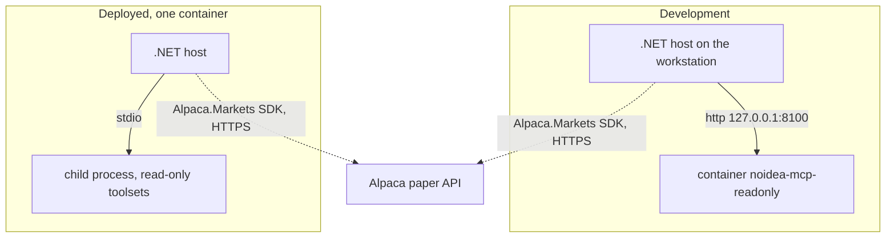

# Alpaca MCP Run Modes

There is **one** Alpaca MCP server and it is read-only. It runs in two ways (ADR-012).

## The two modes

| Mode | Transport | Who starts the server | Lifetime |
|---|---|---|---|
| Development | `streamable-http` | `docker compose -f compose.dev.yaml up -d` | Permanent. It stays up across debug runs. |
| Deployed | `stdio` | The .NET host, as one child process | The host owns it and stops it at shutdown. |



The dotted line is the money path. It does not pass through MCP at all (ADR-001).

### Development

`compose.dev.yaml` runs one container from `docker/alpaca-mcp.dev.Dockerfile`. The port binds
to `127.0.0.1` only, because the server has no authentication. The full procedure is in
[local development](../operations/local-development.md).

### Deployed

`src/Xakpc.Alpaca.NøIdea/Dockerfile` puts the server **inside the application image**:

```text
/opt/python           managed CPython 3.11, installed by uv
/opt/alpaca-mcp       the pinned submodule and its virtual environment
```

A container cannot start a sibling container without the Docker socket, and the socket would
give the application root control of the host. The image therefore holds the server, and no
`docker run` happens at run time. The host starts the child with `ProcessStartInfo` and
`ArgumentList`:

```text
/opt/alpaca-mcp/.venv/bin/alpaca-mcp-server --transport stdio
```

### The toolset

`ALPACA_TOOLSETS` selects the tool groups. It is the server-side control of
[MCP safety](mcp-safety.md).

| Connection | `ALPACA_TOOLSETS` |
|---|---|
| Read-only | `assets,stock-data,options-data,news,corporate-actions` |

**`account` and `trading` must never appear here.** With this value the server exposes 34
tools, all reads. Adding `account,trading` exposes 20 more that can reach the account, and the
host then refuses to start.

### Configuration keys

| Key | Development | Deployed |
|---|---|---|
| `Alpaca__Mcp__ReadOnlyUrl` | `http://127.0.0.1:8100/mcp` | not set |
| `Alpaca__Mcp__ServerCommand` | not set | `/opt/alpaca-mcp/.venv/bin/alpaca-mcp-server` |
| `Alpaca__Mcp__ReadOnlyToolsets` | the value above | the value above |

A URL selects the HTTP transport. A command selects `StdioClientTransport`. **Both together, or
neither, is a startup failure.** There are no trading keys.

### Rules

- **Pin the image tag and the submodule commit** (ADR-011). Do not upgrade during the official
  trading window.
- Pass credentials as environment variables. Do not write them to disk.
- Start a child process with `ProcessStartInfo` and `ArgumentList`. Never build one command
  string. Never use a shell.
- Never publish the development MCP port to `0.0.0.0`.
- The host must confirm the toolset with `ListToolsAsync()` at startup, and must fail if a
  forbidden tool appears.

## Verifying it

```bash
docker compose -f compose.dev.yaml up -d
dotnet run --project src/Xakpc.Alpaca.NøIdea -- --check-mcp
```

The check logs every discovered tool name before it asserts, because when the assertion trips
the first question is always what the server actually exposed.

## Related

- [MCP integration](mcp-integration.md)
- [MCP safety](mcp-safety.md)
- [Local development](../operations/local-development.md)
- [Architecture decisions](../architecture/decisions.md)
