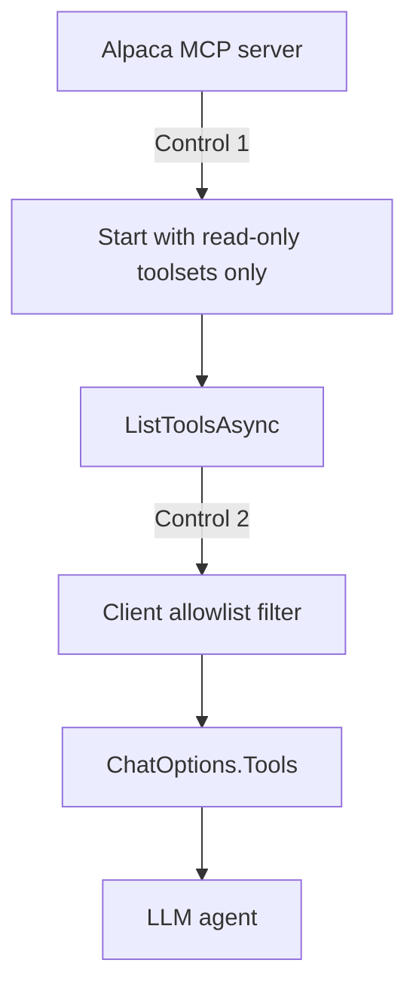

# Alpaca MCP Safety

The MCP connection is the path to money. These rules protect the paper account.

## The security rule

> LLMs can see only the read-only Alpaca MCP toolset. Trading tools exist only on a separate
> MCP connection that deterministic C# code uses.

A tool that does not exist cannot be selected by the model. This is stronger than prompt-only
protection. It is ADR-005 and ADR-006.

## Defence in depth

The host applies two independent controls.



1. **Server side.** Start the research server instance with read-only toolsets only.
2. **Client side.** Filter the discovered tools against `McpToolCatalog` before the host adds
   them to `ChatOptions.Tools`.

If control 1 fails silently after a server upgrade, control 2 still blocks the tool.

## Forbidden for the LLM

An LLM tool list must never contain a tool that can do these actions:

```text
Submit order
Replace order
Cancel order
Close position
Exercise option
Arbitrary shell execution
Arbitrary file access
Environment secret access
```

**Startup must fail if the read-only connection exposes any of these.** This is an
integration failure, not a warning.

## Credentials

Pass credentials to the container as environment variables:

```text
ALPACA_API_KEY
ALPACA_SECRET_KEY
ALPACA_PAPER_TRADE   # must confirm paper mode
```

The host must verify paper mode after it connects, with an account read through the trading
connection. **Startup fails if paper mode cannot be confirmed.**

Both server instances use the same paper account credentials. The difference is the toolset,
not the account.

## Version pinning (ADR-011)

MCP tool names and schemas can change. A silent upgrade during the official window is an
unnecessary risk.

- Pin the submodule commit of `external/alpaca-mcp-server`.
- Pin the Docker image tag.
- Log the pinned version and the approved tool names at startup.
- Validate the required tool names and schemas at startup.
- Treat an incompatible tool schema as an integration failure.
- Do not upgrade during the official trading window.

## Operating rules

- Use paper trading credentials only.
- Apply a timeout to every MCP call.
- Stop new trading when an MCP server is unavailable.
- Use a unique `client_order_id` for each new order.
- Record every MCP tool name and every argument set in `agent_tool_calls` for the audit
  trail.
- Never pass an LLM-generated string to a trading tool argument.

## Process lifetime

The lifetime depends on the run mode. See [MCP run modes](mcp-run-modes.md).

**Development.** `compose.dev.yaml` owns the two containers. `restart: unless-stopped` starts
them again after a crash or a reboot. The containers publish their ports to `127.0.0.1`
**only**, because the servers have no authentication and the trading server can place orders.
A port on `0.0.0.0` gives every machine on the network the power to trade.

**Deployed.** The host owns both child processes. It starts them at startup and stops them at
shutdown.

In both modes:

- A server exit is a **stop new trading** event. See
  [fault handling](../operations/fault-handling.md).
- A failure test must kill each server and confirm the behavior.

## What the read-only server really exposes

A `tools/list` on the read-only server returns read tools only. No order tool, no position
tool, and no account tool is present. Two groups of extra tools do appear:

- Crypto read tools (`get_crypto_bars`, `get_crypto_quotes`, `get_crypto_trades`). The server
  registers them together with the stock data tools.
- Alpaca documentation tools (`search_alpaca_docs`, `fetch_alpaca_doc`,
  `list_alpaca_api_endpoints`, `search_alpaca_api_specs`, `get_alpaca_endpoint_docs`). The
  server always registers them. They make outbound requests to the Alpaca documentation
  site.

They are read-only, but they are not useful for the strategy. `McpToolCatalog` (control 2)
must remove them before the host gives the tool list to an agent.

## Related

- [MCP integration](mcp-integration.md)
- [MCP run modes](mcp-run-modes.md)
- [LLM tool policy](../llm/tool-policy.md)
- [Risk guardrails](../trading/risk-guardrails.md)
- [Fault handling](../operations/fault-handling.md)
