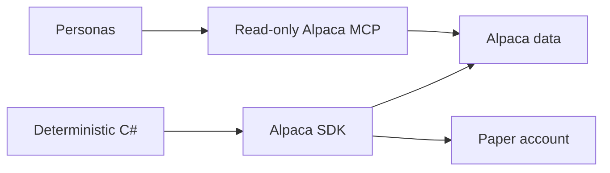

# Alpaca Summary

The application uses two Alpaca access paths. Personas use one read-only MCP server for
research. Deterministic C# uses the typed SDK for account state, market data, and paper
orders.



```csharp
IMarketDataGateway marketData = new LiveMarketDataGateway(clients);
ITradingGateway trading = new LiveTradingGateway(clients);
```

## Contracts

- `IMarketDataGateway` has no order method.
- `ITradingGateway` is the only account-write boundary.
- All SDK clients use `Environments.Paper`.
- Stock requests name IEX. Option-chain requests name Indicative.
- The MCP server starts with read-only toolsets, and the host applies an exact allowlist.
- Alpaca is the source of truth for current account, position, and order state.
- SQLite stores evidence and restart state. It is not a broker-state replacement.

## Related lodes

- [MCP integration](mcp-integration.md)
- [Market-data policy](market-data-policy.md)
- [LLM summary](../llm/summary.md)
- [Risk guardrails](../trading/risk-guardrails.md)
