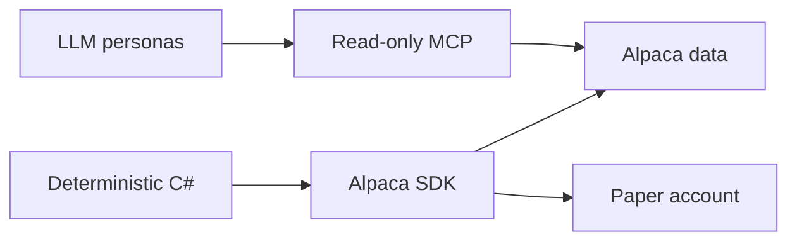

# Alpaca Summary

The application uses two separate Alpaca paths. Models get read-only research tools through
MCP. Deterministic C# uses the typed SDK for account state, current market data, and orders.



```csharp
IMarketDataGateway marketData = new LiveMarketDataGateway(clients);
ITradingGateway trading = new LiveTradingGateway(clients);
```

## Contracts

- `IMarketDataGateway` has no order method.
- `ITradingGateway` is the only account-write boundary.
- All SDK clients use `Environments.Paper`.
- The model tool allowlist rejects every account-changing tool.
- Alpaca is the source of truth for account, position, and order state.
- SQLite is evidence, not broker state.

## Related lodes

- [MCP integration](mcp-integration.md)
- [MCP safety](mcp-safety.md)
- [Market-data policy](market-data-policy.md)
- [Risk guardrails](../trading/risk-guardrails.md)
