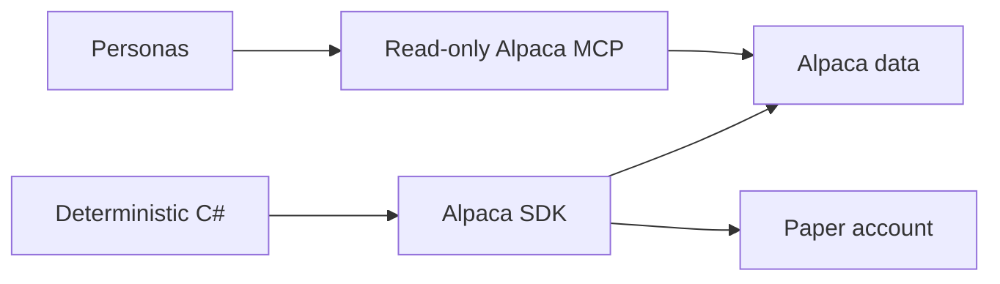

# Alpaca Summary

The application uses two Alpaca access paths. Personas use one read-only MCP server for
research. Deterministic C# uses the typed SDK for account state, market data, and paper
orders.



```csharp
IMarketDataGateway marketData = new LiveMarketDataGateway(clients);
ITradingGateway trading = new LiveTradingGateway(clients);
```

## Contracts

- `IMarketDataGateway` has no order method.
- `ITradingGateway` is the only account-write boundary.
- All SDK clients use `Environments.Paper`.
- Stock requests name IEX. Option-chain requests name Indicative.
- The MCP server starts with read-only toolsets, and the host applies an exact allowlist.
- Alpaca is the source of truth for current account, position, and order state.
- SQLite stores evidence and restart state. It is not a broker-state replacement.

## What an option order can be

Alpaca accepts fewer order shapes for options than for equities. This is an API limit and not a
project decision.

| Parameter | Equity order | Option order |
|---|---|---|
| `type` | market, limit, stop, stop-limit, trailing-stop | **market or limit only** |
| `time_in_force` | many | **day only** |
| `order_class` | `simple`, `bracket`, `oco`, `oto` | **`mleg` only** |
| Take-profit and stop-loss legs | yes | **not available** |

```csharp
var order = new NewOrderRequest(
    request.ContractSymbol,
    OrderQuantity.FromInt64(request.Quantity),
    request.IsBuy ? OrderSide.Buy : OrderSide.Sell,
    request.LimitPrice is null ? OrderType.Market : OrderType.Limit,
    TimeInForce.Day);
```

**A stop-loss cannot be attached to an option order.** The exits are therefore C# rules on a
one-minute timer. See [hard-exit loop](../trading/hard-exit-loop.md).

## Related lodes

- [MCP integration](mcp-integration.md)
- [Market-data policy](market-data-policy.md)
- [Hard-exit loop](../trading/hard-exit-loop.md)
- [LLM summary](../llm/summary.md)
- [Risk guardrails](../trading/risk-guardrails.md)
