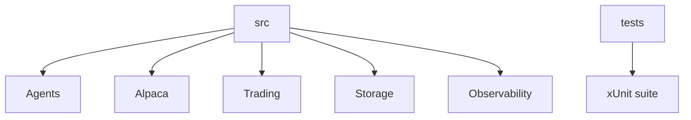

# Application Structure

The application has one source project and one test project.



```text
src/Xakpc.Alpaca.NøIdea/
  Agents/Room/          # War room, personas, and audit sink contracts
  Alpaca/Gateways/      # Live market and trading boundaries
  Observability/        # Console event and transcript output
  Research/             # Read-only web MCP client
  Storage/              # Six-table schema and TradingStore
  Trading/              # Live cycle, risk, exits, and dry run
  Program.cs             # CLI composition root
tests/Xakpc.Alpaca.NøIdea.Tests/
data/raw/                # Retained research files, not runtime input
data/trader.db           # Current audit database
```

## Invariants

- No SQL exists outside `Storage/`.
- No broker call exists in agent code.
- No source folder implements market simulation.
- Build output stays under `build/`.

## Related lodes

- [Component model](component-model.md)
- [Practices](../practices.md)
- [Testing strategy](../operations/testing-strategy.md)
