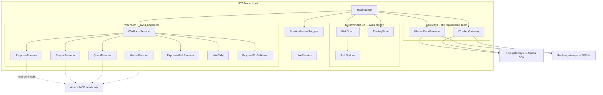

# Component Model

What runs inside the one .NET host, and where the boundaries are.

## The one boundary that matters

> **Agents decide what they want to do. Deterministic C# decides what they are permitted to
> do.**

The war room produces a `ProposedOperation` and a set of votes. That is data. Nothing in the
room can submit, cancel or close an order: `ITradingGateway` is reached only from
`TradingLoop`, and no MCP server this host runs holds an order tool at all (ADR-001, ADR-005,
ADR-006).

`ExposureRiskPersona` sits inside the room but computes in C#. It votes on whether a legal
trade is a sensible use of capacity; it does **not** replace `RiskGuard`, which enforces the
hard limits and cannot be outvoted.

## The three replacement seams

| Seam | Live | Replay |
|---|---|---|
| `IMarketDataGateway` | Alpaca SDK | SQLite, clamped to the replay clock |
| `ITradingGateway` | Alpaca SDK, the only write path | Simulated; holds no Alpaca client |
| `TimeProvider` | `TimeProvider.System` | `ReplayClock`, moves forward only |

`TradingLoop` has no mode flag. A branch on mode is how two paths drift apart, so the loop is
given different gateways instead.

## Related

- [Application structure](application-structure.md)
- [War room](../war-room/summary.md)
- [Risk guardrails](../trading/risk-guardrails.md)
- [Replay mode](../replay/replay-mode.md)
- [Architecture decisions](decisions.md)
