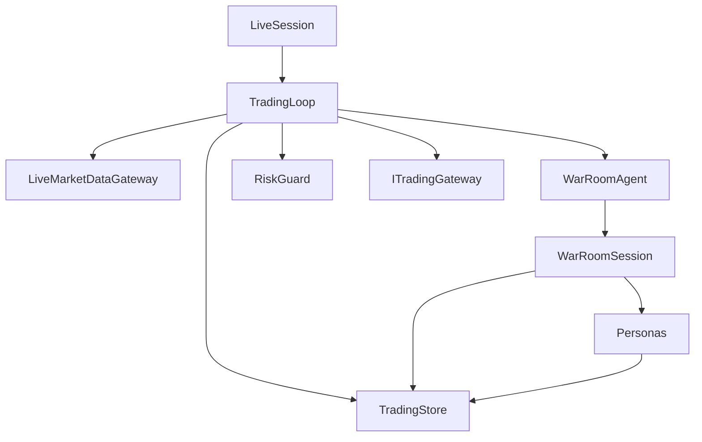

# Component Model



```csharp
public interface IWarRoomAuditSink
{
    Task BeginSittingAsync(...);
    Task RecordToolCallsAsync(...);
    Task CompleteSittingAsync(...);
}
```

## Component contracts

| Component | Responsibility |
|---|---|
| `LiveSession` | Schedule cycles from the live market clock. |
| `TradingLoop` | Order exits, context, decisions, risk, execution, and audit. |
| `WarRoomSession` | Propose, validate, review, discuss, rebut, and vote. |
| Personas | Model-specific research and typed output. |
| `RiskGuard` | Hard deterministic limits. |
| `LiveMarketDataGateway` | Current Alpaca data in project-owned records. |
| `LiveTradingGateway` | Paper-account reads and broker writes. |
| `DryRunTradingGateway` | Delegate reads and intercept writes. |
| `TradingStore` | Current audit schema and atomic order reservation. |

## Related lodes

- [Architecture summary](summary.md)
- [Live cycle](../trading/live-cycle.md)
- [War room](../war-room/summary.md)
- [Storage summary](../storage/summary.md)
