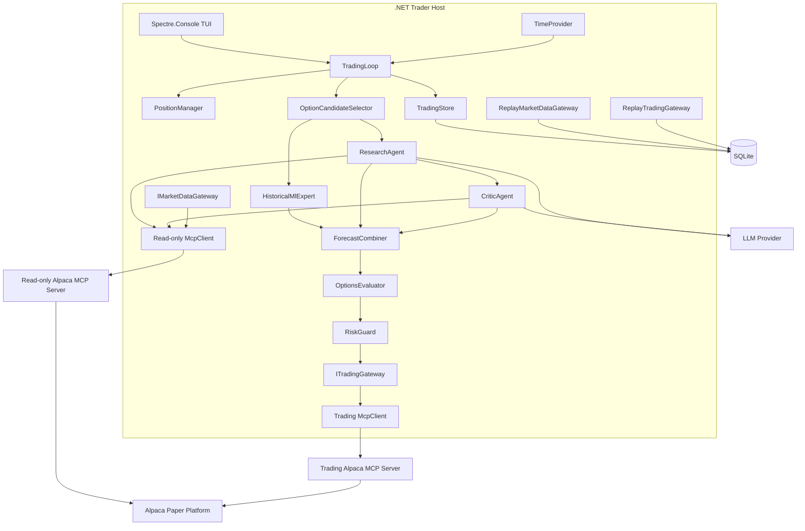
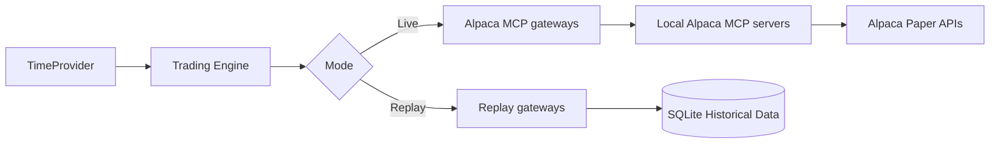

# Internal Component Model

All application components run inside one .NET process. Two Alpaca MCP servers run beside it
as child processes.

## Responsibilities

| Component | Responsibility |
|---|---|
| `TradingLoop` | Runs one cycle. Calls each step in order. Waits for the next cycle. |
| `PositionManager` | Reviews open positions. Applies exit rules. |
| `OptionCandidateSelector` | Selects a small set of option contracts from the chain. |
| `HistoricalMlExpert` | Returns a numerical probability from ML.NET. |
| `ResearchAgent` | LLM expert. Reads news and market data with read-only MCP tools. |
| `CriticAgent` | LLM expert. Challenges the candidate. Returns its own probability. |
| `ForecastCombiner` | Combines three probabilities with reliability weights. |
| `OptionsEvaluator` | Deterministic C#. Gives the market probability reference and checks quote quality. |
| `RiskGuard` | Applies the hard risk rules. Only this component allows an order. |
| `IMarketDataGateway` | Typed read path to Alpaca. Live and replay implementations. |
| `ITradingGateway` | Typed write path to Alpaca. Live and replay implementations. |
| `McpToolCatalog` | The approved read-only tool allowlist. Filters `ListToolsAsync()`. |
| `TradingStore` | All SQLite reads and writes. |
| `TraderConsole` | Read-only Spectre.Console TUI. |
| `TimeProvider` | Live time or replay time. |

## Three key seams

The architecture has three replacement seams. All must stay clean.

1. **`IMarketDataGateway`** — `AlpacaMcpMarketDataGateway` for live,
   `ReplayMarketDataGateway` for replay.
2. **`ITradingGateway`** — `AlpacaMcpTradingGateway` for live, `ReplayTradingGateway` for
   replay. Replay simulates an order. It never sends one.
3. **`TimeProvider`** — live time or replay time. The same strategy code runs in both modes.

The LLM agents do not use the gateways. They call approved MCP tools directly through
`ChatOptions.Tools`. In replay mode the agents receive replay tool implementations, not live
MCP tools. See [replay mode](../replay/replay-mode.md).

## Related

- [Application structure](application-structure.md)
- [MCP integration](../alpaca/mcp-integration.md)
- [Live cycle](../trading/live-cycle.md)
- [Replay mode](../replay/replay-mode.md)
