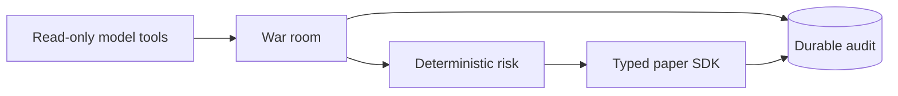

# Architecture Decisions

This file contains active decisions only. The identifiers keep their original meanings
because source comments use them as stable references.



## ADR-001: Split Alpaca access by caller

Personas use one read-only Alpaca MCP connection. Deterministic C# uses the typed
`Alpaca.Markets` SDK for account state, market data, and orders. There is no trading MCP
connection.

## ADR-002: Use Microsoft.Extensions.AI

All model providers use the `IChatClient` contract and the common function-calling path.
Semantic Kernel is not part of the application.

## ADR-003: Keep one application host

One .NET console process owns the live session and one deployed Alpaca MCP child process.
The application has no distributed service or UI requirement.

## ADR-004: Use SQLite and Dapper

`TradingStore` owns visible SQL and Dapper mapping. The application does not use an ORM or a
database server.

## ADR-005: Keep LLM tools read-only

Personas receive explicit allowlists. They cannot submit, replace, cancel, close, or exercise
an order or position. A forbidden Alpaca tool stops startup.

## ADR-006: Deterministic C# owns money

Models return typed actions and policy suggestions. `RiskGuard`, `OrderCoordinator`, and the
typed trading gateway decide if and how a broker request occurs.

## ADR-008: Use a fixed symbol universe

`TradingOptions.TrackedSymbols` holds 13 symbols. The host does not scan the market for new
underlyings.

## ADR-011: Pin the Alpaca MCP server

The repository pins submodule commit `872abbf28dab6cdde7d341fc13ac139b8002d1d9`, package
version `2.3.0`, and an exact client allowlist. A server upgrade needs an explicit review.

## ADR-012: Use one MCP server in two run modes

Development uses streamable HTTP on `127.0.0.1:8100`. A deployed host starts the same server
as one `stdio` child. Exactly one transport configuration must exist.

## ADR-013: Do not use the historical model for trade edge

The measured model did not beat the option-price reference. The runtime has no historical
forecaster or replay path. Text and current market evidence remain the strategy inputs.

## ADR-014: Use project-owned gateway records

Gateway interfaces do not expose Alpaca SDK types. Live gateways map SDK responses to records
that tests and trading code own.

## ADR-017: Use portable read-only research tools

Alpaca and Keenable research tools use MCP function calls across providers. Their results are
untrusted prompt data. Typed outputs and deterministic risk limit their effect.

## ADR-019: Use one war-room process for two purposes

`WarRoomSession` handles new trades and position reviews. The request changes the purpose,
allowed actions, and optional position. The process does not fork into two implementations.

## ADR-020: Make each persona a class

Each seat owns its prompt, provider, model, and phase behavior. `ExposureRiskPersona` is
deterministic C# and proves that a persona does not need an LLM.

## ADR-021: Use private confidence-weighted votes

Four reviewers vote. The tally divides by every reviewer. A required failed vote breaks
quorum. Positive net conviction above the threshold sets the size multiplier.

## ADR-022: Report model cost as an estimate

Token counts come from provider usage. `ModelPricing` converts them with a hard-coded table.
The dollar result is an estimate and can omit external service charges.

## ADR-023: Implement dry run as a gateway

`DryRunTradingGateway` delegates reads and intercepts writes. Live data and audit behavior stay
active while no broker write reaches Alpaca.

## ADR-024: Use structured logs as the operator view

The host has no interactive TUI. Stable event identifiers describe the run. Spectre.Console
maps the identifiers and structured values to a curated read-only view. The plain file keeps
the complete clipped information record. Model messages are clipped to 4,000 characters and
tool results to 2,000 characters in the file. The console shows transcript warnings, errors,
`Sending`, and `Finished` events. The active-seat table changes only when an event arrives.

## ADR-025: Restrict stale-quote testing

`--once` can run outside market hours. `--allow-stale-quotes` is valid only with `--dry-run`,
so the relaxed quote-age check cannot reach a broker order. The flag skips quote-age checks
in catalog admission, proposal pre-validation, and final risk validation. It does not permit
a missing timestamp, an incomplete quote, or a wide spread.

## ADR-028: Use TOON only for proposer prompt payloads

Large proposer payloads use `Toon.Encode`. Stored evidence and data read back by the host stay
JSON.

## ADR-029: An open needs an approving seat

A new trade needs `net > threshold` **and** one seat that voted Approve. The threshold measures
conviction against a trade; below zero it is cleared by a room that says nothing, which opened
a position no seat backed. A close keeps the threshold alone, because leaving a position must
stay easy. See [votes to verdict](../war-room/vote-and-verdict.md).

## ADR-030: A rejected hold closes the position

A position review that proposes nothing is a hold, and a room that votes that hold down has
decided to leave the position. `WarRoomAgent` returns a close for the reviewed symbol when the
verdict is `Rejected`, quorum was met, no seat faulted, and the net is below zero. A faulted or
withdrawn sitting produces an empty or incomplete tally and cannot close anything, because a
half-broken room must never sell the book.

## Durable audit contracts

- Schema version `3` has eight tables and does not migrate an obsolete database.
- A sitting ends as `completed`, or as `abandoned` through `--recover-sittings`. The row is
  updated and never deleted, because other tables point at its proposal ID and an interrupted
  sitting is evidence.
- `AuditPersistenceException` stops the live session. A mandatory close still gets one
  risk-reducing submit attempt after its first audit failure.
- An accepted decision and its order reservation commit in one transaction before broker
  submission.

```csharp
await store.RecordDecisionAndReserveAsync(decision, order, cancellationToken);
```

## Related lodes

- [Architecture summary](summary.md)
- [War room](../war-room/summary.md)
- [Risk guardrails](../trading/risk-guardrails.md)
- [Storage schema](../storage/schema.md)
- [Research summary](../research/summary.md)
