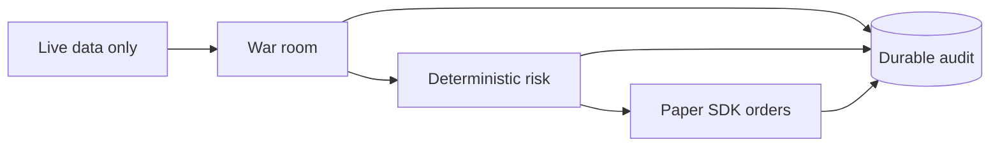

# Architecture Decisions

This file contains current decisions only.



## ADR-001: Keep model tools read-only

Models receive explicit research tool allowlists. They never receive broker-write tools or
credentials. The typed SDK performs account writes.

## ADR-002: Use project-owned gateway records

`IMarketDataGateway` and `ITradingGateway` keep Alpaca SDK types at the integration boundary.
Tests construct project records directly.

## ADR-003: Use a war room for strategy decisions

A proposer creates one typed operation. Reviewers analyse independently. The room discusses.
The proposer can revise once. Reviewers vote privately. Weighted conviction sets size.

## ADR-004: Keep risk deterministic

`RiskGuard` validates every open action after the room. Models cannot modify `RiskOptions`.
Mandatory exits run before model calls.

## ADR-005: Use live Alpaca data only

The runtime has no stored-market import and no market simulation. Dry run uses current data
and replaces only broker writes. Retained raw files are research input outside the host.

## ADR-006: Use SQLite for durable audit and restart state

Schema version `3` stores sittings, passes, tool calls and results, decisions, orders, equity,
the active policy, and review cursors. It has no market-data or model-response cache.

## ADR-007: Do not migrate obsolete databases

Startup accepts an empty file or schema version `3`. An obsolete non-empty file fails. An
operator must archive or remove it before clean initialization.

## ADR-008: Audit failure is fatal

An audit write throws `AuditPersistenceException`. The live session stops. A mandatory close
still gets one close attempt after a pre-close audit failure because it reduces risk.

## ADR-009: Link authorization to execution

An accepted open decision and order reservation commit in one transaction. Every live or
dry-run order links to its authorizing decision event.

```csharp
await store.RecordDecisionAndReserveAsync(decision, order, cancellationToken);
```

## ADR-010: Preserve measured negative evidence

The historical model did not beat the option-price reference. The evidence stays in the
research lode. It does not justify a runtime historical-data feature.

## Related lodes

- [Architecture summary](summary.md)
- [Risk guardrails](../trading/risk-guardrails.md)
- [Audit schema](../storage/schema.md)
- [Historical model evidence](../research/historical-model-evidence.md)
