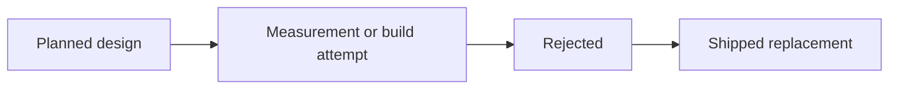

# Dropped Designs

The designs that were planned, then rejected. Each entry gives what it was, why it lost, and
what replaced it. Read this file before you propose one of them again.



The project started from one large design document. That document is deleted, because
approximately three quarters of it described a system that was never built. The entries below
are what it decided that is still useful. The current architecture is in
[architecture summary](summary.md) and [decisions](decisions.md).

## A historical model in the live path

A trained model was to give a probability for each candidate contract. The model was built and
measured on a common set of rows.

```text
historical model:        0.17142
option-price reference:  0.15345
decision: no runtime historical forecaster
```

A Brier score is `(probability - outcome)^2`, so a lower score is better. The simple
option-price reference won. Larger disagreement between the two made the model less accurate,
so the disagreement could not be used as an edge filter either. See ADR-013.

`data/dataset.csv`, `data/historical-model.zip`, and `data/test-set-log.md` stay on disk as the
evidence. `data/raw/` is not read by the live host and is not in `trader.db`.

**Acceptance contract for a future model.** A model must beat a simple reference on the same
rows and on a later time split. Each feature must be available before its decision time. Paper
trade outcomes are the preferred calibration source. Historical evidence is not a result.

## A replay and simulation mode

A replay engine was to run the strategy against stored bars with a swapped `TimeProvider`, and
to keep future data out of each decision. It was never built, and the live host has no market
simulation and no data-import operation.

The reason is the measurement above. Replay exists to train and score a forecaster. With no
runtime forecaster, replay scores nothing that reaches an order. The equivalent evidence now
comes from the durable audit of real paper sessions. See
[session results](../operations/session-results.md).

The word `replay` in the source means one thing only: `replayMissingSells` retries an uncertain
broker sell with the same client ID. It is order reconciliation and not market replay.

## A second MCP connection for broker writes

The plan gave the host two MCP connections: one read-only research server and one trading
server that owned order submission through `ITradingGateway`.

The trading connection was dropped before the first order. A tool call is a text contract with a
remote process, and an order moves money. The typed `Alpaca.Markets` SDK gives compile-time types,
one client ID contract, and a direct error path. One connection also removes the risk that a
research seat finds a write tool. See ADR-001 and ADR-005.

## Reliability-weighted experts

Each expert was to receive a weight from its measured accuracy, and a combiner was to merge the
forecasts into one probability. `MinExpertSamplesForAdaptiveWeight` was the planned control.

Two sessions of paper trading do not produce enough scored outcomes to move a weight. A weight
from a sample that small measures noise. The room instead uses private
confidence-weighted votes with a fixed tally, and each seat states its own probability for
later scoring. See ADR-021 and [votes to verdict](../war-room/vote-and-verdict.md).

Counterfactual scoring of stored decisions is the first step to any future weighting. It is not
built. See [improvements](../plans/improvements.md).

## An interactive dashboard

A full-screen terminal application was to show positions, forecasts, and controls.

The operator view is read-only instead. Every run line carries a stable event identifier, the
console renders those identifiers, and the complete clipped log goes to a timestamped plain
file. A display fault cannot stop trading or an audit write, and an operator cannot press a key
that changes a live decision. See ADR-024 and
[console rendering](../operations/console-rendering.md).

## A research agent and a critic agent

The first design had two model roles: one agent that researched a forecast and one that
criticized it.

The shipped system has five seats and five phases. A proposer searches the catalog and submits
one proposal. Three reviewers analyse it in parallel, discuss, and vote privately. A
deterministic seat judges exposure. The pair design has no vote, no quorum, and no way to
record who was for a trade. See [war-room summary](../war-room/summary.md).

## Related lodes

- [Architecture summary](summary.md)
- [Architecture decisions](decisions.md)
- [War-room summary](../war-room/summary.md)
- [Session results](../operations/session-results.md)
- [Improvements](../plans/improvements.md)
