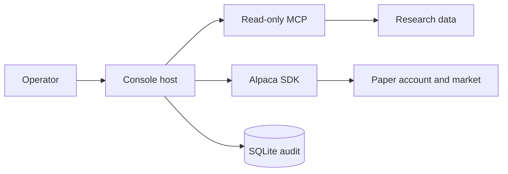

# Architecture Summary

One .NET console host reads the current Alpaca paper market, runs a multi-model war room,
applies deterministic risk rules, and uses the typed Alpaca SDK for paper orders. SQLite
keeps the full durable audit.



```csharp
var loop = new TradingLoop(marketData, trading, agent, riskGuard, options, store, time, log);
```

## Boundaries

- Personas return typed data only.
- `RiskGuard` owns permission to add risk.
- `ITradingGateway` owns broker writes.
- `IWarRoomAuditSink` owns sitting and tool evidence.
- `TradingStore` owns SQL and transaction boundaries.
- `LiveSession` owns market-clock scheduling and fatal audit propagation.

The host has no market-simulation or data-import component. Retained raw data is outside the
runtime boundary.

## Related lodes

- [Component model](component-model.md)
- [System context](system-context.md)
- [Architecture decisions](decisions.md)
- [Project summary](../summary.md)
