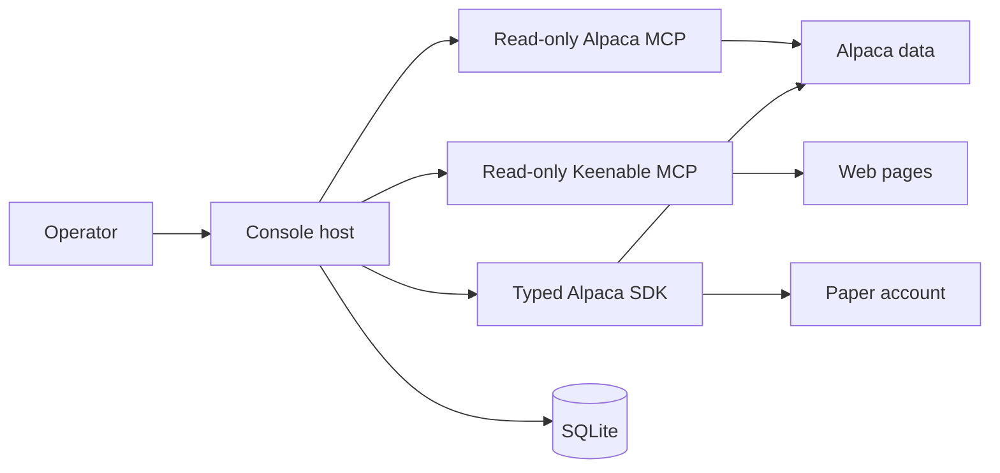

# Architecture Summary

One .NET 10 console host reads the Alpaca paper account, builds a tradeable option catalog,
runs a multi-provider war room, applies deterministic risk rules, and submits paper orders.
SQLite stores audit evidence and the minimum restart state.



```csharp
var loop = new TradingLoop(marketData, trading, agent, riskGuard, options, store, time, logger);
```

## Components

| Component | Contract |
|---|---|
| `LiveSession` | Read the market clock, run cycles, wait after each cycle, and stop at a closed market. |
| `TradingLoop` | Reconcile state, run exits and reviews, build context, apply risk, and record decisions. |
| `WarRoomSession` | Propose, pre-validate, analyse, discuss, rebut, and vote. |
| `RiskGuard` | Own every deterministic permission to add account risk. |
| `ITradingGateway` | Own account reads and broker writes through the typed SDK. |
| `IMarketDataGateway` | Map current Alpaca data to project-owned records. |
| `TradingStore` | Own SQL, transactions, audit rows, and durable policy state. |
| `SpectreConsoleLoggerProvider` | Map structured run events to the operator console. |

The application has one source project and one xUnit test project. Source folders separate
agents, Alpaca gateways, research, storage, trading, and observability. The host has no market
simulation, data import, web UI, or interactive terminal commands. The Spectre console is a
read-only operator view.

## Boundaries

- Personas return typed data. They do not receive a broker, shell, file, or database tool.
- The Alpaca MCP connection is read-only. The optional Keenable MCP connection is also
  read-only.
- The typed Alpaca SDK is the only broker-write path. All SDK clients use the paper
  environment.
- Alpaca owns current account, position, and order state. SQLite owns evidence and restart
  state.
- The Spectre console is curated. The timestamped plain file keeps the complete clipped log.
- A console presentation fault cannot stop trading or durable audit work.
- A normal process stops when the market is closed. A deployed image starts one Alpaca MCP
  child over `stdio`. Development uses one HTTP container on `127.0.0.1:8100`.

## Non-goals

These were decided at the start and are still true. Do not add one without a decision record.

- No web interface, no hosted application, and no interactive terminal application.
- No Semantic Kernel and no agent framework above `Microsoft.Extensions.AI`.
- No Python or Node service in the runtime. The pinned MCP server is the one external process.
- No market simulation, no data import, and no historical forecaster in the decision path.
- No broker tool for a model, and no second MCP connection that can write.

Designs that were planned and then rejected are in [dropped designs](dropped-designs.md).

## Standing risks

The architecture answers none of these. They are named so that a measurement, and not a hope,
closes them.

- **No proven edge.** No session has produced a profit that came from a war-room open. Every
  dollar so far came from a deterministic exit. See
  [session results](../operations/session-results.md).
- **The spread and the decay are the first opponent.** A long option bought at the ask and sold
  at the bid loses before the underlying moves. A short horizon makes this worse.
- **Free data is indicative.** Option quotes come from the Indicative feed and stock quotes from
  IEX. They are enough to admit or refuse a contract. They are not a consolidated tape.
- **A model provider is a single point of failure.** A seat that cannot answer stops the room,
  because a faulted vote breaks quorum.
- **The pinned MCP server can change.** An upgrade can rename a tool or change a result shape.
  The pin and the allowlist make this visible at startup instead of during a cycle.

## Technology

The main dependencies are `Alpaca.Markets`, `Microsoft.Extensions.AI`, the Anthropic and
OpenAI-compatible clients, Model Context Protocol, SQLite, Dapper, Toon, Spectre.Console,
logging, and xUnit. Spectre renders event-based panels, tables, colors, and active model rows.

```xml
<TargetFramework>net10.0</TargetFramework>
```

## Related lodes

- [Architecture decisions](decisions.md)
- [Dropped designs](dropped-designs.md)
- [Project summary](../summary.md)
- [Live cycle](../trading/live-cycle.md)
- [Alpaca integration](../alpaca/mcp-integration.md)
- [Storage schema](../storage/schema.md)
