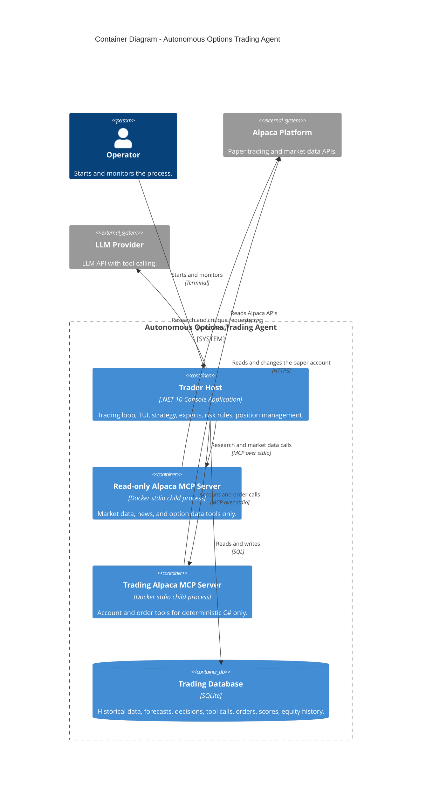

# Architecture Summary

The architecture is intentionally small. One .NET 10 console application holds the trading
loop, the experts, the risk rules, and the terminal user interface. Two external systems
exist: the Alpaca platform (through two local Alpaca MCP servers) and an LLM provider.
SQLite is the only database.

## Goals

1. The system runs without per-trade human approval.
2. The system can find, evaluate, open, monitor, and close option positions.
3. The system can use numerical models and LLM agents in one decision.
4. Each expert produces a testable result.
5. The system records which experts are accurate.
6. The system gives more influence to experts with better measured performance.
7. The system compares its forecast with current option market information.
8. The system applies hard risk limits before it sends an order.
9. The system recovers safely after a process restart.
10. The system supports historical replay before the live competition window.

## Non-goals

No web UI, no React, no mobile application, no microservices, no Kubernetes, no message
broker, no Semantic Kernel, no Alpaca CLI, no Claude Agent SDK process, no Python service,
no Node.js service. No high-frequency trading and no sub-second reaction. No market-wide
stock scanner. No complete options pricing engine. No real money.

## Container view

## The five parts

| Part | Responsibility | Lode |
|---|---|---|
| Alpaca MCP gateways | All broker and market data access. Two connections. | [mcp-integration](../alpaca/mcp-integration.md) |
| ML.NET | The numerical historical probability expert. | [historical-ml-expert](../experts/historical-ml-expert.md) |
| Microsoft.Extensions.AI | The Research Agent and the Critic Agent with read-only MCP tools. | [llm-stack](../llm/llm-stack.md) |
| Deterministic C# | Combiner, Options Evaluator, Risk Guard, Position Manager. | [live-cycle](../trading/live-cycle.md) |
| SQLite | The complete audit trail. | [schema](../storage/schema.md) |

## Core strategy

> Estimate a short-term stock price outcome with independent experts. Compare that estimate
> with current option pricing. Trade only when the difference is large enough and all hard
> risk rules pass.

## Core experiment

> Measure which experts are accurate, and give more influence to the experts with better
> measured results.

## The MCP security rule

> LLMs can see only a read-only Alpaca MCP toolset. Trading tools exist only on a separate
> MCP connection that deterministic C# code uses.

## Related

- [System context](system-context.md)
- [Component model](component-model.md)
- [Application structure](application-structure.md)
- [Technology stack](technology-stack.md)
- [Architecture decisions](decisions.md)
