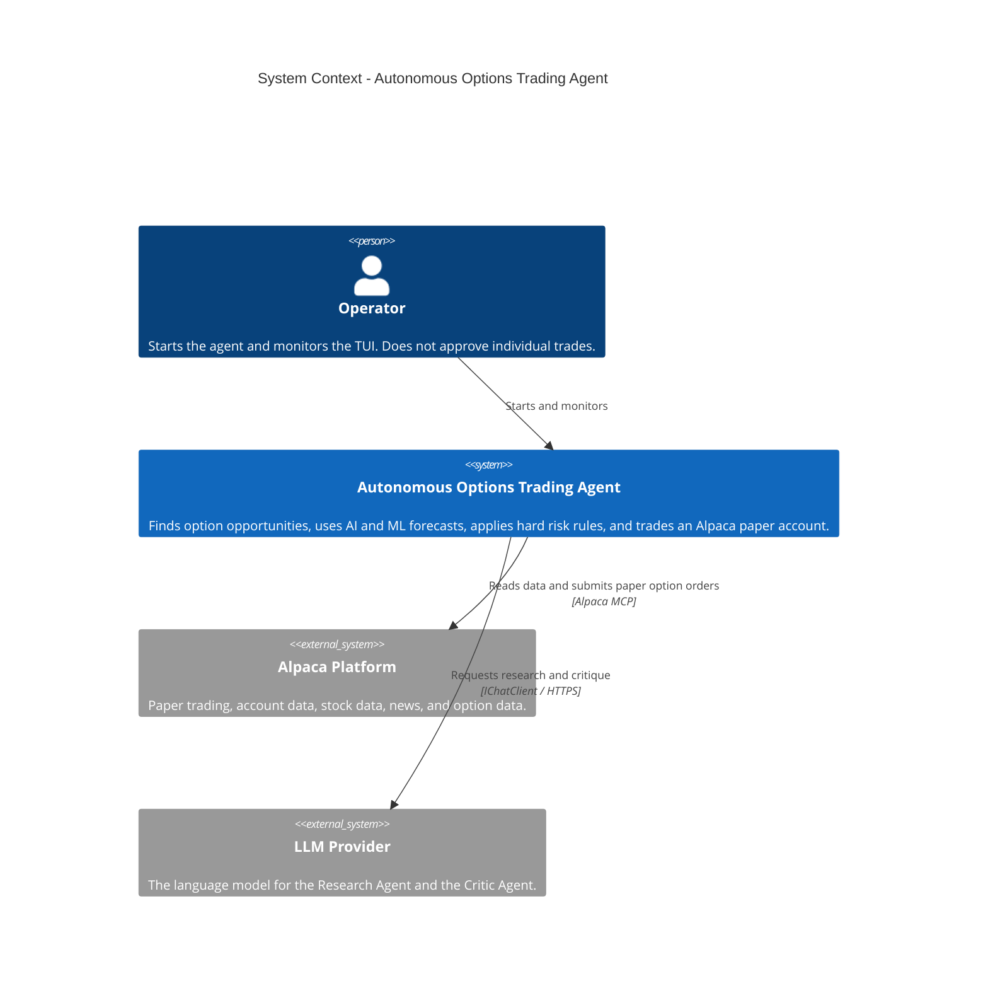

# System Context

The system has one human role and two external systems.

## Operator

The operator starts the program and watches the terminal user interface. The operator does
**not** approve each trade. This is a hackathon requirement. See [TUI](../trading/tui.md).

## Alpaca platform

Alpaca gives the paper trading account, the account state, the market clock, stock bars,
news, and option chains. Access is through two local Alpaca MCP servers only. One instance
exposes read-only toolsets. The other exposes the trading toolsets. See
[MCP integration](../alpaca/mcp-integration.md).

**Alpaca is the source of truth for current positions and current orders.** SQLite is not.
The simple rule is:

> Alpaca stores what the account owns. SQLite stores what the agent thought and did.

## LLM provider

The provider gives the model for the Research Agent and the Critic Agent. Access is through
`Microsoft.Extensions.AI.IChatClient`. The provider can be Anthropic through the official
Anthropic C# SDK. The exact model name is configuration. The architecture does not depend on
one model name.

## Trust boundary

The LLM provider is outside the trust boundary for money. The LLM agents see only the
read-only MCP connection. The trading MCP tools are never in an LLM tool list. The system
never sends an LLM-generated command to the operating system. See
[tool policy](../llm/tool-policy.md).

## Deployment

The process does not need to run 24 hours each day. It must operate during the required US
market sessions. The process can stay running and use the Alpaca clock to wait while the
market is closed. It can run on the developer workstation, an existing server, or a small
VM. The host needs Docker, because it starts each Alpaca MCP server in a container. A paid
deployment platform is not required.

## Related

- [Architecture summary](summary.md)
- [Competition constraints](../operations/competition-constraints.md)
