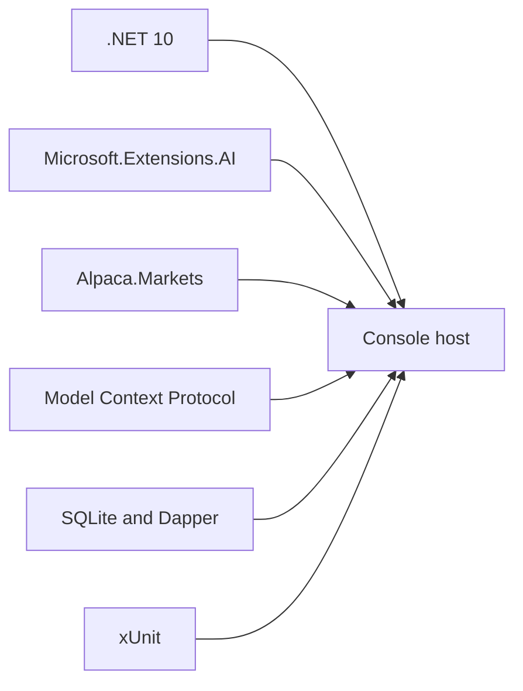

# Technology Stack



| Need | Choice | Reason |
|---|---|---|
| Runtime | .NET 10, C# | Typed async host and records. |
| Broker and market | `Alpaca.Markets` | Typed paper-account API. |
| Model abstraction | `Microsoft.Extensions.AI` | One `IChatClient` contract. |
| Research tools | MCP | Discoverable read-only tools. |
| Storage | SQLite and Dapper | Small durable store with visible SQL. |
| Logging | `Microsoft.Extensions.Logging` | Structured console events. |
| Tests | xUnit | Fast deterministic suite. |

```xml
<TargetFramework>net10.0</TargetFramework>
```

The project does not use an ORM, a hosted web UI, a second broker abstraction, or a runtime
historical-data engine.

## Related lodes

- [Practices](../practices.md)
- [Architecture decisions](decisions.md)
- [Application structure](application-structure.md)
