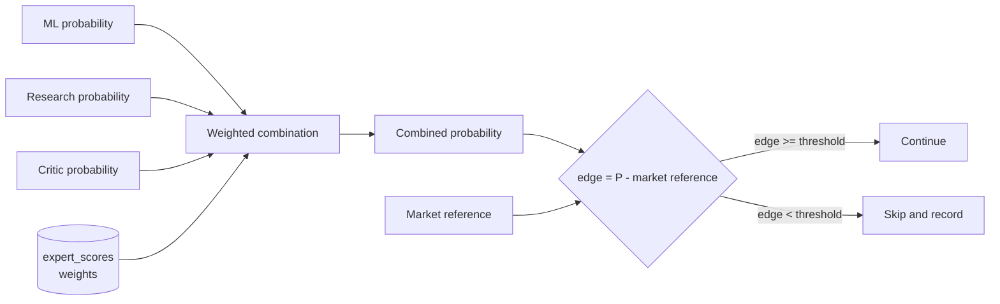

# Forecast Combination and Expert Reliability

The `ForecastCombiner` combines three probabilities into one. The
[Options Evaluator](options-evaluator.md) is not part of this combination. It gives the
external reference.



## Cold start

If an expert has fewer samples than `MinExpertSamplesForAdaptiveWeight`, the system uses
**equal weights**. The default sample threshold is 20. Historical replay is the main source
of the initial reliability values.

## The reliability metric: Brier score

For one forecast:

```text
Brier error = (predicted probability - actual outcome)^2
```

The actual outcome is 1 if the event occurred and 0 if it did not. A lower score is better.

```text
Prediction 0.80, actual 1  ->  (0.80 - 1)^2 = 0.04
Prediction 0.80, actual 0  ->  (0.80 - 0)^2 = 0.64
```

## The MVP weight rule

```text
rawWeight = 1 / max(0.05, averageBrierScore)
weight    = rawWeight / sum(allRawWeights)
```

The `max(0.05, ...)` term prevents a division by zero and caps the influence of a very small
average error.

This rule is simple. It is not a final statistical model. A later version can use a better
calibration or a stacking model.

## Storage

Weights live in the `expert_scores` table, one row for each forecaster:

```sql
CREATE TABLE expert_scores (
    forecaster          TEXT PRIMARY KEY,
    sample_count        INTEGER NOT NULL,
    average_brier       REAL,
    weight              REAL NOT NULL,
    updated_utc         INTEGER NOT NULL
);
```

Individual forecasts live in the `forecasts` table and link to an evaluation run. See
[storage schema](../storage/schema.md).

## The edge test

```text
edge = combined probability - market probability reference
```

The system continues only if the edge is large enough. **The minimum edge threshold is
TBD.** It is a strategy parameter, not an architecture constant. See
[strategy parameters](../trading/strategy-parameters.md).

## Unit tests

Test the Brier calculation, the weight normalization, the cold-start path, and the edge
calculation. See [testing strategy](../operations/testing-strategy.md).

## Related

- [Experts summary](summary.md)
- [Live cycle](../trading/live-cycle.md)
