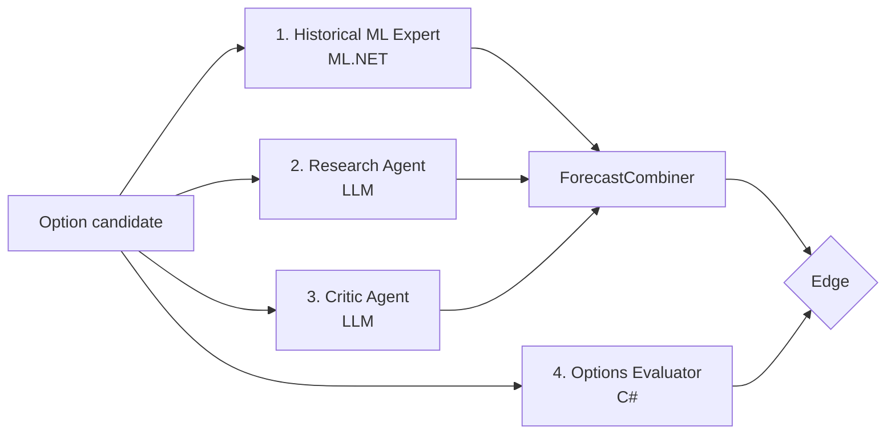

# Experts

The system has four experts. Only two are LLM agents. Each expert is independent. The
system does not ask one LLM to select a trade from nothing.



| Expert | Technology | Output | Weighted |
|---|---|---|---|
| ~~Historical ML Expert~~ | ML.NET logistic regression | Probability | **No (ADR-013)** |
| Research Agent | LLM through `IChatClient` | Probability, confidence, evidence | Yes |
| Critic Agent | LLM through `IChatClient` | Probability, confidence, risks | Yes |
| Options Evaluator | Deterministic C# | Market reference and a quote-quality verdict | No |

**The Historical ML Expert is excluded.** It was measured against the option price and lost in
every period, so it carries no weight and no gate. See
[model against the market](../replay/model-vs-market.md) and ADR-013.

That leaves **two** weighted forecasters, the Research Agent and the Critic Agent. The Options
Evaluator gives the **external market reference** and rejects a bad contract; it is not part of
the weighted combination.

> The remaining alpha hypothesis rests entirely on the two LLM agents, because they read news
> text. That is a different information channel from price history, which is the channel that
> was just measured and found to hold nothing the option price does not already carry.

## The hypothesis under test

> A numerical model and LLM-based research can find short-term cases where the probability
> of a stock price outcome is different from the probability reference in current option
> pricing.

The system checks if the independent sources agree enough to justify an option trade.

## Example

```text
Historical ML Expert: 63%
Research Agent:       59%
Critic Agent:         46%

Combined estimate:    56%
Option market reference: 39%
Difference (edge):    +17 percentage points
```

## The measurement rule

Every expert output is a probability. Every probability is testable after the outcome is
known. The system scores each expert with the Brier score and gives more influence to the
accurate experts. See [forecast combination](forecast-combination.md).

## Related

- [Historical ML Expert](historical-ml-expert.md)
- [Research Agent](research-agent.md)
- [Critic Agent](critic-agent.md)
- [Options Evaluator](options-evaluator.md)
- [Forecast combination](forecast-combination.md)
