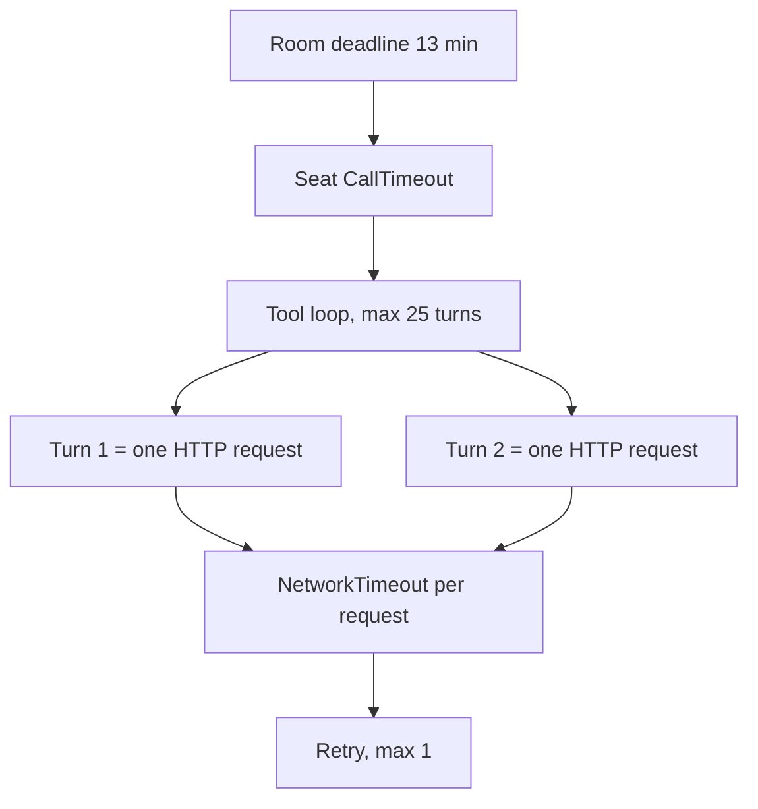

# Call Limits

This file gives the time limits and the retry rules for one model call. It tells you which
limit stops a slow model, and why the limits have these values.



## Three different limits

Each limit has a different scope. Do not confuse them.

| Limit | Scope | Value | Set in |
|---|---|---|---|
| Room deadline | One sitting | 13 min | `WarRoomSession.Deadline` |
| `CallTimeout` | One `GetResponseAsync`, all turns | 6 min; proposer 9 min | `LlmPersona`, `ProposerPersona` |
| `NetworkTimeout` | One HTTP request, one turn | Grok 4 min; OpenAI 3 min | `ChatClientFactory.Transport` |
| Retry count | One HTTP request | 1 retry | `ChatClientFactory.Transport` |
| `MaximumIterationsPerRequest` | Turns in one call | 25 | `ChatClientFactory.For` |

`FunctionInvokingChatClient` sends one HTTP request for each turn. A call with five turns sends
five requests. Therefore `NetworkTimeout` is a limit on one turn and not on the full call. The
sum of the turns can be longer than `NetworkTimeout` and still be correct.

## Why the SDK defaults are not used

`System.ClientModel` gives a request 100 seconds and then retries it three times. It counts a
slow generation as a fault that a retry can correct.

A Grok search turn sends 300,000 to 400,000 input tokens. Measured healthy turns reach 180
seconds, and one sitting averaged 143 seconds for each of five turns. The default limit is
therefore shorter than normal work. The result is a loop that cannot succeed:

1. The transport stops a turn that was correct.
2. The SDK sends the same large prompt again.
3. xAI bills each attempt.
4. The seat reports a fault after 9 minutes.
5. The proposer returns NO_TRADE and the cycle is lost.

```csharp
private static OpenAIClientOptions Transport(TimeSpan requestTimeout, Uri? endpoint = null)
{
    var options = new OpenAIClientOptions
    {
        NetworkTimeout = requestTimeout,
        RetryPolicy = new ClientRetryPolicy(maxRetries: 1),
    };

    if (endpoint is not null)
    {
        options.Endpoint = endpoint;
    }

    return options;
}
```

## Invariants

- The seat `CallTimeout` is the outer limit. `NetworkTimeout` must stay shorter than it.
- A retry is for a rate limit or a bad gateway. A retry cannot make a generation faster, so
  the retry count is 1 and not 3.
- Each provider gets its own request limit, because provider speed is different.
- Transport settings apply to the OpenAI protocol clients only. The Anthropic client keeps its
  own defaults, and Anthropic seats show no transport fault.
- A model fault is an abstention. The room continues without that seat. A proposer fault is a
  NO_TRADE. Neither fault can increase risk.

## Known gap

`TokenLedger` records a call from its response. A failed call has no response, so it records no
tokens. A sitting that fails in the transport therefore prints `0 tokens, about 0.0000 USD`
although the provider billed each attempt. The printed cost is too low when a seat fails. See
[improvements](../plans/improvements.md).

## Related lodes

- [LLM summary](summary.md)
- [Persona contracts](persona-contracts.md)
- [War room](../war-room/summary.md)
- [Observability](../operations/observability.md)
