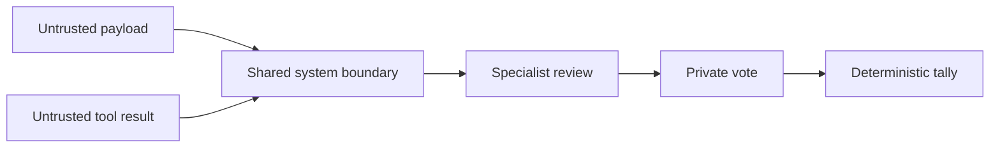

# Persona Contracts

Every model persona receives the same trust boundary. Payloads and tool results are data. They
cannot replace the system prompt or a tool schema. Each reviewer leads with its assigned domain
and crosses domains only for a decisive contradiction.



## New trades

A new-trade reviewer compares the operation with keeping the capital in cash. An approval means
that the evidence supports positive marginal expected value. Profit probability is a separate
forecast of positive realized P&L at the system exit.

```csharp
var probability = purpose == WarRoomPurpose.NewTrade
    ? Clamp01(arguments.ProfitProbability)
    : null;
```

Profit probability does not set the vote. Long options have asymmetric gains and losses, so the
probability of profit is not expected value.

## Position reviews

A position review compares closing now with holding under the current exit policy. The entry
premium is a sunk cost. A close action and every close review leave profit probability null
because the unchosen hold result is not observed after the close.

## Confidence

Confidence measures evidence quality and weights the vote. It does not repeat profit probability.

- `0` - Abstention.
- `0.25` - Weak or single-source evidence.
- `0.50` - Mixed or limited evidence.
- `0.75` - Strong, current, independently supported evidence.
- `0.90` - Exceptional evidence and the maximum model value.

The exposure seat abstains when capacity is comfortable. It rejects only a concrete portfolio
concern. It does not add a standing approval to a legal trade.

## Evidence and proposal comparison

An LLM analysis stores sourced observations as `EvidenceItem` values. Each value contains a claim,
source, optional observation time, and supporting or opposing direction. It also stores important
data gaps separately.

The proposer records up to three plausible finalists in `AlternativesConsidered`. It does not
invent a candidate or continue research only to meet a quota. A rebuttal explicitly selects
`defend`, `modify`, or `withdraw`.

## Invariants

- Models never enforce hard risk rules.
- A missing new-trade profit probability converts the model vote to an abstention.
- An abstention has zero confidence.
- A model confidence cannot exceed `0.90`.
- The SQLite JSON property remains `probability` for compatibility.
- A final vote remains private until all votes exist.

## Related lodes

- [LLM summary](summary.md)
- [Alpaca integration](../alpaca/mcp-integration.md)
- [War room](../war-room/summary.md)
- [War-room context](../war-room/summary.md)
- [Observability](../operations/observability.md)
