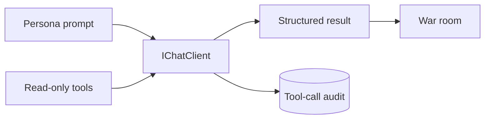

# LLM Summary

The war room uses provider-specific `IChatClient` instances behind one call path. Every LLM
seat receives the same external read-only research list. Phase-specific local tools provide
catalog queries and typed output schemas. These local tools do not change external state.



```csharp
var response = await client.GetResponseAsync(messages, options, cancellationToken);
```

## Contracts

- Each persona is a class with its own prompt, provider, and model.
- The OpenAI market and quant seats use the Responses API and do not send `temperature`.
- `--cheap` selects Claude Haiku 4.5 and GPT-5.4-nano. It does not change Grok.
- Grok proposes and rebuts. OpenAI reviews market and quant evidence. Anthropic is the skeptic.
- Every model prompt treats payloads and tool results as untrusted data.
- The proposer emits a typed `ProposedOperation`.
- New-trade forecasts use profit probability; close reviews leave it null.
- Reviewer evidence stores a source, observation time, and direction.
- Reviewers analyse independently before discussion.
- Votes remain private until tally.
- Tool calls and results persist with proposal ID, persona, phase, and model.
- `TokenLedger` records calls and tokens by persona.
- Model failure cannot directly increase risk.
- Audit persistence failure is fatal.
- The Alpaca allowlist rejects account, order, position-change, exercise, shell, file, and
  secret-access tools.
- The Keenable allowlist contains `search_web_pages` and `fetch_page_content` only.
- `--no-mcp` removes Alpaca research. `--no-web-search` removes Keenable research.

Prompts, turns, tool details, and model answers go to the plain file with clipping. One message
is limited to 4,000 characters. One tool result is limited to 2,000 characters. Each call also
writes one `Sending` event before it goes out. The Spectre console shows this event as an active
seat row. It shows the matching `Finished` event as a compact result. See
[observability](../operations/observability.md). Durable tool request and result JSON also goes
to SQLite.

The host writes the complete clipped information record to one plain UTF-8 file under
`data/logs/`. The file name contains the UTC process start time. The console hides normal prompt,
model-text, tool-call, and tool-result events. It does not hide warnings or errors.

## Related lodes

- [War room](../war-room/summary.md)
- [War-room context](../war-room/summary.md)
- [Persona contracts](persona-contracts.md)
- [Alpaca integration](../alpaca/mcp-integration.md)
- [Storage schema](../storage/schema.md)
