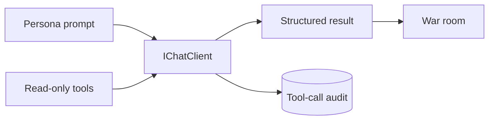

# LLM Summary

The war room uses provider-specific `IChatClient` instances behind one call path. Personas
receive staged typed context and can use the same read-only research tool list.



```csharp
var response = await client.GetResponseAsync(messages, options, cancellationToken);
```

## Contracts

- Each persona is a class with its own prompt, provider, and model.
- The proposer emits a typed `ProposedOperation`.
- Reviewers analyse independently before discussion.
- Votes remain private until tally.
- Tool calls and results persist with proposal ID, persona, phase, and model.
- `TokenLedger` records calls and tokens by persona.
- Model failure cannot directly increase risk.
- Audit persistence failure is fatal.

Full prompts, turns, tool details, and model answers go to the console transcript. Durable
tool request and result JSON also goes to SQLite.

## Related lodes

- [War room](../war-room/summary.md)
- [Staged context](../war-room/staged-context.md)
- [Tool policy](tool-policy.md)
- [Proposal review audit](../storage/proposal-review-audit.md)
