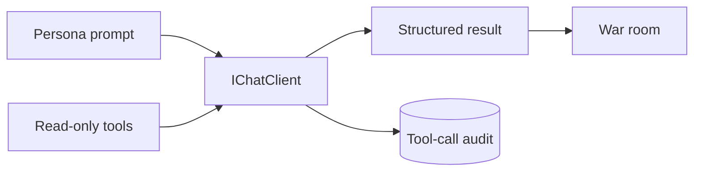

# LLM Summary

The war room uses provider-specific `IChatClient` instances behind one call path. Every LLM
seat receives the same external read-only research list. Phase-specific local tools provide
catalog queries and typed output schemas. These local tools do not change external state.



```csharp
var response = await client.GetResponseAsync(messages, options, cancellationToken);
```

## Contracts

- Each persona is a class with its own prompt, provider, and model.
- The OpenAI market and quant seats use the Responses API and do not send `temperature`.
- `--cheap` selects Claude Haiku 4.5 and GPT-5.4-nano. It does not change Grok.
- Grok proposes and rebuts. OpenAI reviews market and quant evidence. Anthropic is the skeptic.
- Every model prompt treats payloads and tool results as untrusted data.
- The proposer emits a typed `ProposedOperation`.
- New-trade forecasts use profit probability; close reviews leave it null.
- Reviewer evidence stores a source, observation time, and direction.
- Reviewers analyse independently before discussion.
- Votes remain private until tally.
- Tool calls and results persist with proposal ID, persona, phase, and model.
- `TokenLedger` records calls, tokens, and cached input by persona.
- The Anthropic seat carries a one-hour prompt-cache breakpoint on its system block.
- Model failure cannot directly increase risk.
- Each seat has its own call limit, each HTTP turn has its own transport limit, and a request
  gets one retry. See [call limits](call-limits.md).
- Audit persistence failure is fatal.
- The Alpaca allowlist rejects account, order, position-change, exercise, shell, file, and
  secret-access tools.
- The Keenable allowlist contains `search_web_pages` and `fetch_page_content` only.
- `--no-mcp` removes Alpaca research. `--no-web-search` removes Keenable research.

## Prompt cache

OpenAI and xAI discount a repeated prefix on their own. Anthropic does not: without an explicit
breakpoint in the request there is no cache at all. On 2026-09-02 the skeptic seat reported
2,082,211 input tokens with none cached, for 4.90 of the run's 9.38 USD, while Grok cached 48
percent and OpenAI 59 percent.

`LlmPersona` therefore marks the system block for the Anthropic seat only:

```csharp
var content = new TextContent(systemPrompt);
return Provider == ModelProvider.Anthropic
    ? content.WithCacheControl(new CacheControlEphemeral { Ttl = Ttl.Ttl1h })
    : content;
```

One marker is sufficient. Anthropic orders a request as tools, then system, then messages, and
caches every prefix up to the marker, so the tool schemas are covered as well. The lifetime is
one hour, because a sitting takes 8 to 10 minutes and cycles are 20 minutes apart: the
five-minute default expires before the next seat asks the same question.

The win is larger than one hit per sitting. `FunctionInvokingChatClient` sends the whole prefix
again on every turn of the tool loop, so the turns after the first read the cache the first one
wrote. The measured first skeptic analysis of a run reported 107,892 input tokens with 47,550
cached over four turns. Between sittings, the prompt differs by phase and purpose, so an
analysis caches against the next sitting's analysis and not against this sitting's vote.

> **A cache write bills above fresh input.** `ModelPricing` models the read rate only, so the
> reported cost of the first call on a new prefix is low. Token counts stay exact.

Prompts, turns, tool details, and model answers go to the plain file with clipping. One message
is limited to 4,000 characters. One tool result is limited to 2,000 characters. Each call also
writes one `Sending` event before it goes out. The Spectre console shows this event as an active
seat row. It shows the matching `Finished` event as a compact result. See
[observability](../operations/observability.md). Durable tool request and result JSON also goes
to SQLite.

The host writes the complete clipped information record to one plain UTF-8 file under
`data/logs/`. The file name contains the UTC process start time. The console hides normal prompt,
model-text, tool-call, and tool-result events. It does not hide warnings or errors.

## Related lodes

- [War room](../war-room/summary.md)
- [Votes to verdict](../war-room/vote-and-verdict.md)
- [Call limits](call-limits.md)
- [Persona contracts](persona-contracts.md)
- [Alpaca integration](../alpaca/mcp-integration.md)
- [Storage schema](../storage/schema.md)
- [Session baselines](../plans/session-baselines.md)
