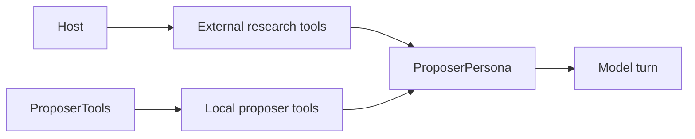

# LLM Integration

## The stack

```text
Microsoft.Extensions.AI
  IChatClient                    one interface, three providers
  FunctionInvokingChatClient     runs the tool loop
  ChatResponse.Usage             token counts, for the cost ledger
Anthropic                        Claude, through `AsIChatClient()`
Microsoft.Extensions.AI.OpenAI   GPT, and Grok through an endpoint override
ModelContextProtocol             McpClient, read-only Alpaca tools
```

`ChatClientFactory` resolves a provider to an `IChatClient` and caches one client per
provider. Every persona reaches its model the same way, which is what makes a mixed room
cheap to build (ADR-020).

## One call path, and no streaming

> **`LlmPersona.InvokeAsync` is the only place that speaks to a model.**

Each seat and each phase uses it, so the transcript, the token ledger and the fault handling
are written once. The proposer had a second call path before this; it recorded tokens but
wrote no transcript.

Each call is `GetResponseAsync`. **Nothing streams.** No part of this application reads a word
before the turn is complete, and a streamed turn gives back its text, its tool calls and its
usage in parts that the record must then assemble again.

`InvokeAsync` writes the full conversation to the log: the prompt and the payload, each turn,
**each tool call with its arguments**, each tool answer, and a tally of the finish reason,
turns, tool calls, tokens and seconds. Each line carries the seat's own event id (ADR-027).
See [observability](../operations/observability.md).

## Sampling parameters

> **A Claude seat sends no temperature.**

Claude Opus 5 and Sonnet 5 removed the sampling parameters. A request that carries
`temperature` is rejected with 400, and a rejected call becomes an abstention, so the skeptic
sets `SamplingTemperature` to null. `LlmPersona.SamplingTemperature` defaults to
`Temperature`, so the GPT and Grok seats keep theirs.

## The trust rule

> **A model never receives a tool that can move money.**

Every tool a persona holds is read-only: the 25 approved Alpaca MCP tools, the two approved
Keenable web tools, and the structured-output tools it answers through. `submit_analysis`,
`speak`, `cast_vote` and `submit_proposal` execute nothing — they are schemas, not actions.

## Who owns a tool

The host owns the external research tool list. `--no-mcp` removes the Alpaca tools.
`--no-web-search` removes the Keenable tools. Replay gives an empty research list. A seat can
refuse the list with `WantsResearchTools`.

The application also creates local response tools. These tools do not use a network and do
not move money. `LlmPersona` owns the common analysis, discussion, and vote tools.
`ProposerTools` owns `submit_proposal`, `submit_rebuttal`, and
`get_tradeable_contracts`. `ProposerPersona` owns the prompts and the turn flow.

```csharp
var proposalTool = _tools.CreateProposalTool(
    offered, held, allowedActions, operation => captured = operation);

var tools = [.. ResearchTools, _tools.CreateCatalogTool(market), proposalTool];
```



**Each tool is an ordinary MCP function call**, so a seat operates the same on all three
providers. A provider-hosted tool did not: Anthropic maps one to its own `web_search` server
tool, and the OpenAI chat-completions endpoint answers `Unknown parameter:
web_search_options` with a 400 (ADR-017).

No MCP server this host runs holds an order tool at all (ADR-001), so there is no allowlist
to misconfigure. `McpToolCatalog.AssertNoForbiddenTool` proves it at startup rather than
assuming it.

## Structured output, not parsed text

Every persona answers through a **forced tool call**, validated against a schema by the API
before it reaches this process.

This replaced free-text JSON parsing for a specific reason: every malformed answer degraded
to a silent hold. A drifted field name produced an agent that quietly did nothing, which over
a four-day run is indistinguishable in the logs from an agent that chose not to trade.

A model that returns nothing usable becomes an **abstention**, never an approval.

## What a payload is written in

> **The proposer and reviewer context use TOON. Nothing decodes TOON.**

`ProposerPersona` encodes its search, review and rebuttal payloads with
`ToonFormat.Toon.Encode`, which writes a uniform array one time as a header and then as rows
instead of repeating each field name. The proposer sends the full contract catalog when it
fits the 60,000-character boundary. Otherwise it sends a summary index and uses the local
catalog query tool from `ProposerTools`. Reviewers receive only the proposed contract
neighborhood and basic portfolio context. **The saving is not measured here** (ADR-028).

Structured proposal-pass columns stay JSON. The legacy `evidence_json` column currently holds
TOON seat evidence. `market_snapshot_json` and cache rows stay JSON.

## Untrusted input

Tool output, and web content in particular, is data rather than instruction. Every system
prompt says so. The exposure is bounded rather than removed: a poisoned page can influence a
vote, but `RiskGuard` still caps the result at 2% of equity and four positions, so the worst
case is one bad trade inside the limits (ADR-017).

## Cost

`TokenLedger` records usage per persona and model; `ModelPricing` estimates dollars.

> Token counts are fact. The dollar figure is an estimate and a floor: the rate table is
> hardcoded, an unpriced model is excluded and named, and hosted web search normally bills
> per call outside token counts.

## Related

- [Tool policy](tool-policy.md)
- [War room](../war-room/summary.md)
- [MCP safety](../alpaca/mcp-safety.md)
- [Architecture decisions](../architecture/decisions.md) — ADR-020, ADR-022, ADR-027, ADR-028
