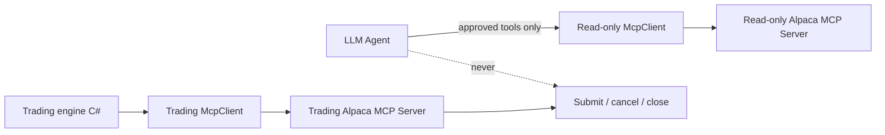

# LLM Architecture

Two of the four experts are LLM agents: the [Research Agent](../experts/research-agent.md)
and the [Critic Agent](../experts/critic-agent.md).

## The stack

```text
Microsoft.Extensions.AI
  IChatClient
  FunctionInvokingChatClient
ModelContextProtocol (C# MCP SDK)
  McpClient
  ListToolsAsync -> ChatOptions.Tools
```

The provider can be Anthropic through the official Anthropic C# SDK. The exact model is
configuration. **The architecture does not depend on one model name.**

The project does **not** use Semantic Kernel (ADR-002). It does **not** use the Claude Agent
SDK. It does **not** use the Alpaca CLI (ADR-001).

## The trust rule



An LLM produces a probability. It never produces an action. The two MCP connections are
separate processes, so the model cannot reach a trading tool.

## Related

- [LLM stack](llm-stack.md)
- [Tool policy](tool-policy.md)
- [Output contracts](output-contracts.md)
- [MCP integration](../alpaca/mcp-integration.md)
