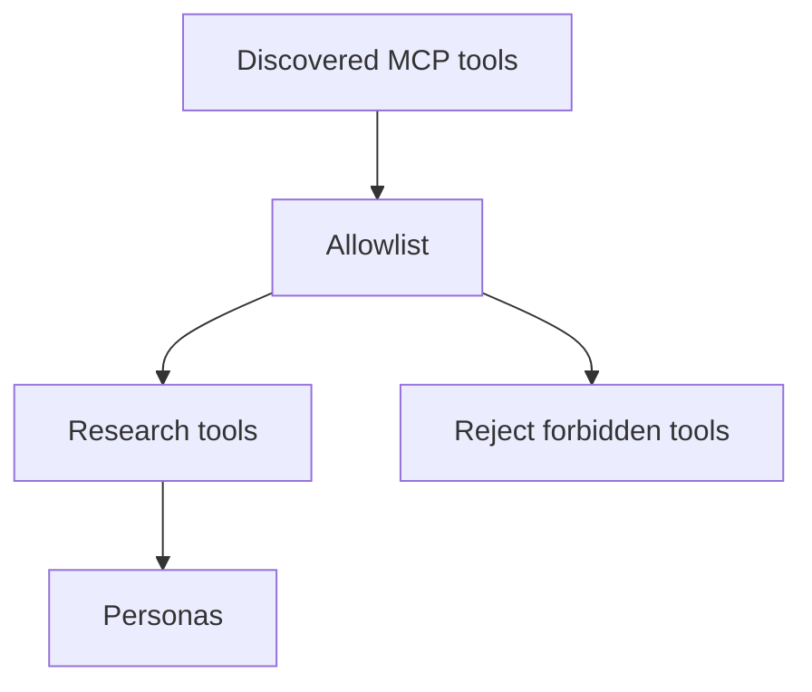

# LLM Tool Policy

Model personas receive read-only research tools only. They never receive account, order,
position-change, file, shell, or database tools.



```csharp
var approved = McpToolCatalog.Approve(discoveredTools);
```

The allowlist is explicit. Startup fails when a forbidden tool appears. The host can also
start with `--no-mcp` or `--no-web-search` to remove a research source.

## Invariants

- No persona can submit, replace, cancel, or close an order.
- No persona receives Alpaca credentials.
- Web and MCP content is untrusted prompt input.
- `RiskGuard` validates model actions after tool use and voting.
- Each model tool request and result is written to `agent_tool_calls`.

## Related lodes

- [MCP safety](../alpaca/mcp-safety.md)
- [LLM summary](summary.md)
- [Audit schema](../storage/schema.md)
- [Risk guardrails](../trading/risk-guardrails.md)
