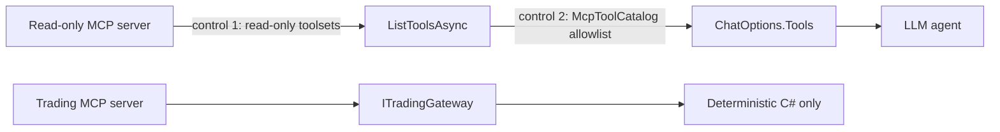

# LLM Tool Policy

LLM tools are **read-only**. This is ADR-005 and it is not negotiable.

## The source of the tools

The tools come from the **read-only Alpaca MCP connection** only. The trading MCP connection
is a separate process. Its tools never enter an LLM tool list.

## Allowed tool categories

```text
Stock bars and quotes
News
Exact-option snapshots, quotes, trades, and bars
Greeks when available
Reference-symbol market data
Asset and contract metadata
```

The Research Agent and the Critic Agent use the same approved list. The exact MCP tool names
come from the pinned server version. `McpToolCatalog` holds the allowlist.

`get_option_chain` and `get_option_contracts` are not approved. C# builds the authoritative
tradeable contract catalog once. The proposer can query that immutable in-memory catalog with
the local `get_tradeable_contracts` tool. The local tool does not call Alpaca.

```text
get_tradeable_contracts(
    underlying: "NVDA",
    option_type: "call",
    strike_from: 210,
    strike_to: 230,
    offset: 0)
```

## Forbidden

```text
Submit order
Replace order
Cancel order
Close position
Exercise option
Run arbitrary shell command
Read arbitrary file
Read environment secrets
```

**Startup must fail if the read-only connection exposes any of these.**

## Defence in depth



1. Start the research server instance with read-only toolsets only.
2. Filter the discovered tools against the allowlist before the host registers them.

If control 1 fails silently after a server upgrade, control 2 still blocks the tool.

## The isolation rule

There is no path from a model output to an account change. The model can request a read-only
MCP tool. The host executes that tool on the read-only connection. Only `RiskGuard` and
`ITradingGateway` can reach the trading connection.

## Why the tool set is small

A small approved tool set reduces:

- Tool-selection errors.
- Token use.
- Latency.
- Security risk.

## Replay

In replay mode the agent tools must read from the replay data source. **They must not
connect to the live Alpaca MCP server.** See [replay mode](../replay/replay-mode.md).

## Related

- [MCP safety](../alpaca/mcp-safety.md)
- [Risk guardrails](../trading/risk-guardrails.md)
- [LLM stack](llm-stack.md)
- [Tradeable contract catalog](../trading/tradeable-contract-catalog.md)
