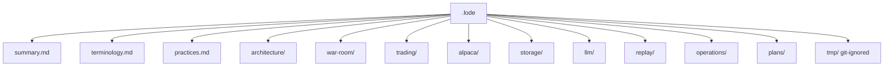

# Lode Map

The index of all lode files. Read this first.

## Root

| File | Content |
|---|---|
| [summary.md](summary.md) | One-paragraph project snapshot and the current code state. |
| [terminology.md](terminology.md) | Finance terms and project terms. |
| [practices.md](practices.md) | KISS and YAGNI, code rules, repository layout, C# style, dependencies. |
| [lode-map.md](lode-map.md) | This index. |

The Architecture Vision Document at the repository root
(`alpaca-autonomous-options-agent-avd.md`) **seeded** this lode. It is no longer a source of
truth.

**Order of authority:**

1. The **code**, for what the system does.
2. **Measured evidence** in this lode, for what works. A measurement beats a plan.
3. The **ADRs**, for decisions taken deliberately.
4. The **AVD**, as history only.

The AVD described a four-expert system with a weighted Historical ML Expert and a cheap
filter keyed on a model-versus-market gap. Measurement retired both (ADR-013). Where the AVD
and this lode disagree, **this lode wins**; where this lode and the code disagree, the code
wins.

## architecture/

| File | Content |
|---|---|
| [summary.md](architecture/summary.md) | Goals, non-goals, container view, the five parts. |
| [system-context.md](architecture/system-context.md) | C4 context, actors, trust boundary, deployment. |
| [component-model.md](architecture/component-model.md) | Internal components and the three replacement seams. |
| [application-structure.md](architecture/application-structure.md) | Current and target folder layout. |
| [technology-stack.md](architecture/technology-stack.md) | The approved and rejected technology. |
| [decisions.md](architecture/decisions.md) | ADR-001 to ADR-028. ADR-013 excludes the ML expert. ADR-014 owns the gateway records. ADR-015 is the bar-availability rule. ADR-016 makes the agent direct the strategy. ADR-017 gives it read-only research tools and web search. ADR-018 superseded. ADR-019 is the war room, ADR-020 personas as classes, ADR-021 votes size the position, ADR-022 cost reporting, ADR-023 dry run as a gateway, ADR-024 console logging and the event ids, ADR-025 out-of-hours testing, ADR-026 the audit trail, ADR-027 the full model conversation in the console, ADR-028 the TOON proposer payload. |

## war-room/

| File | Content |
|---|---|
| [summary.md](war-room/summary.md) | **The decision process.** Five phases, the seats, votes to size, cost. |

## trading/

| File | Content |
|---|---|
| [summary.md](trading/summary.md) | The loop, the tracked symbols, the gate order. |
| [universe.md](trading/universe.md) | The 13 tradable symbols, the four admission rules, and the screening evidence. |
| [live-cycle.md](trading/live-cycle.md) | The twelve steps and the decision sequence. |
| [position-lifecycle.md](trading/position-lifecycle.md) | States, exit policy, LLM re-check triggers. |
| [risk-guardrails.md](trading/risk-guardrails.md) | Paper mode, write isolation, fail closed, idempotency. |
| [strategy-parameters.md](trading/strategy-parameters.md) | The agent-owned policy defaults and the hard bounds it cannot cross. |

## alpaca/

| File | Content |
|---|---|
| [summary.md](alpaca/summary.md) | The two connections, the gateway seams, and the source-of-truth rule. |
| [mcp-integration.md](alpaca/mcp-integration.md) | The two connections, tool discovery, the two typed gateways. |
| [mcp-run-modes.md](alpaca/mcp-run-modes.md) | Permanent HTTP servers in development, stdio children when deployed. Toolsets and configuration keys. |
| [mcp-safety.md](alpaca/mcp-safety.md) | Defence in depth, forbidden tools, credentials, version pinning. |
| [market-data-policy.md](alpaca/market-data-policy.md) | The measured feeds, the no-`feed`-argument rule, and the account-entitlement risk. |

## storage/

| File | Content |
|---|---|
| [summary.md](storage/summary.md) | The two roles of the database, the Dapper conventions, and money precision. |
| [schema.md](storage/schema.md) | The full SQL schema, the cache tables, and the `available_utc` no-leak column. |

## llm/

| File | Content |
|---|---|
| [summary.md](llm/summary.md) | The stack, the one call path and the no-streaming rule, sampling rules, the trust rule, structured output, and cost. |
| [tool-policy.md](llm/tool-policy.md) | Allowed and forbidden MCP tools. Defence in depth. |

## replay/

| File | Content |
|---|---|
| [summary.md](replay/summary.md) | Why replay is required. |
| [replay-mode.md](replay/replay-mode.md) | The three seams, the no-leak rule, the limits. |
| [model-training.md](replay/model-training.md) | The row, the label, the 14 features, the split, and the measured result. |
| [model-vs-market.md](replay/model-vs-market.md) | **The verdict.** The model loses to the option price. The ladder-slope method, the numbers, and what it breaks. |
| [historical-dataset.md](replay/historical-dataset.md) | What is on disk, the raw page format, the two data faults, and the regular-hours decision. |
| [option-data-availability.md](replay/option-data-availability.md) | What the CLI gives for option history and what it does not. Why the market reference is live-only. |

## operations/

| File | Content |
|---|---|
| [summary.md](operations/summary.md) | Deployment and the two paper accounts. |
| [local-development.md](operations/local-development.md) | The compose servers, the ports, the endpoint, and the manual `.http` tests. It mirrors `DEVELOPMENT.md` in the repository root. |
| [competition-constraints.md](operations/competition-constraints.md) | Official FAQ rules, the Thursday-EOD finish line, judging, submission, requirement mapping. |
| [restart-recovery.md](operations/restart-recovery.md) | The startup sequence and reconciliation. |
| [fault-handling.md](operations/fault-handling.md) | The failure table and the three severity levels. |
| [testing-strategy.md](operations/testing-strategy.md) | Unit, integration, replay, and failure tests. |
| [observability.md](operations/observability.md) | The ten demo questions and where each answer lives. |

## plans/

| File | Content |
|---|---|
| [mvp-roadmap.md](plans/mvp-roadmap.md) | Eight phases with exit conditions. |
| [definition-of-done.md](plans/definition-of-done.md) | The competition-start checklist. |
| [open-strategy-questions.md](plans/open-strategy-questions.md) | The remaining open design questions. |
| [main-risks.md](plans/main-risks.md) | Six risks and their mitigations. |
| [ml-hypotheses.md](plans/ml-hypotheses.md) | Recorded ML ideas and why each was rejected. Read before trying another model. |

## tmp/ (git-ignored)

| File | Content |
|---|---|
| (empty) | Session scraps only. |

## Reading paths

- **New session:** [summary](summary.md) → [terminology](terminology.md) →
  [architecture summary](architecture/summary.md).
- **Write trading code:** [practices](practices.md) →
  [live cycle](trading/live-cycle.md) → [risk guardrails](trading/risk-guardrails.md).
- **Write agent code:** [war room](war-room/summary.md) → [tool policy](llm/tool-policy.md) →
  [llm summary](llm/summary.md).
- **Run it locally:** [local development](operations/local-development.md) →
  [MCP run modes](alpaca/mcp-run-modes.md).
- **Write Alpaca code:** [mcp integration](alpaca/mcp-integration.md) →
  [mcp safety](alpaca/mcp-safety.md) → [market data policy](alpaca/market-data-policy.md).
- **Judge the model:** [model against the market](replay/model-vs-market.md).
- **Train the model:** [model training](replay/model-training.md) →
  [option data availability](replay/option-data-availability.md) →
  [historical dataset](replay/historical-dataset.md).
- **Plan the next step:** [MVP roadmap](plans/mvp-roadmap.md) →
  [open strategy questions](plans/open-strategy-questions.md).
