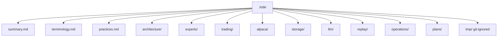

# Lode Map

The index of all lode files. Read this first.

## Root

| File | Content |
|---|---|
| [summary.md](summary.md) | One-paragraph project snapshot and the current code state. |
| [terminology.md](terminology.md) | Finance terms and project terms. |
| [practices.md](practices.md) | KISS and YAGNI, code rules, repository layout, C# style, dependencies. |
| [lode-map.md](lode-map.md) | This index. |

The source Architecture Vision Document is **outside** the lode, at the repository root:
`alpaca-autonomous-options-agent-avd.md` (revision 2, MCP). The code is the source of truth.
The AVD is the source of this lode.

## architecture/

| File | Content |
|---|---|
| [summary.md](architecture/summary.md) | Goals, non-goals, container view, the five parts. |
| [system-context.md](architecture/system-context.md) | C4 context, actors, trust boundary, deployment. |
| [component-model.md](architecture/component-model.md) | Internal components and the three replacement seams. |
| [application-structure.md](architecture/application-structure.md) | Current and target folder layout. |
| [technology-stack.md](architecture/technology-stack.md) | The approved and rejected technology. |
| [decisions.md](architecture/decisions.md) | ADR-001 to ADR-011. |

## experts/

| File | Content |
|---|---|
| [summary.md](experts/summary.md) | The four experts and the hypothesis under test. |
| [historical-ml-expert.md](experts/historical-ml-expert.md) | Expert 1. ML.NET logistic regression. |
| [research-agent.md](experts/research-agent.md) | Expert 2. LLM research with read-only tools. |
| [critic-agent.md](experts/critic-agent.md) | Expert 3. LLM challenge. Not a veto. |
| [options-evaluator.md](experts/options-evaluator.md) | Expert 4. Deterministic C#. Market reference and quote quality. |
| [forecast-combination.md](experts/forecast-combination.md) | Brier score, reliability weights, the edge test. |

## trading/

| File | Content |
|---|---|
| [summary.md](trading/summary.md) | The loop, the tracked symbols, the gate order. |
| [live-cycle.md](trading/live-cycle.md) | The twelve steps and the decision sequence. |
| [position-lifecycle.md](trading/position-lifecycle.md) | States, exit policy, LLM re-check triggers. |
| [risk-guardrails.md](trading/risk-guardrails.md) | Paper mode, write isolation, fail closed, idempotency. |
| [strategy-parameters.md](trading/strategy-parameters.md) | Decided values and the TBD list. |
| [tui.md](trading/tui.md) | The read-only Spectre.Console monitor view. |

## alpaca/

| File | Content |
|---|---|
| [summary.md](alpaca/summary.md) | The two connections, the gateway seams, and the source-of-truth rule. |
| [mcp-integration.md](alpaca/mcp-integration.md) | The two connections, Docker and stdio, tool discovery, the two typed gateways. |
| [mcp-safety.md](alpaca/mcp-safety.md) | Defence in depth, forbidden tools, credentials, version pinning. |
| [market-data-policy.md](alpaca/market-data-policy.md) | What the free Basic plan gives in real time, and what it does not. |

## storage/

| File | Content |
|---|---|
| [summary.md](storage/summary.md) | The two roles of the database, the Dapper conventions, and money precision. |
| [schema.md](storage/schema.md) | The full SQL schema and the ER diagram. |

## llm/

| File | Content |
|---|---|
| [summary.md](llm/summary.md) | The stack and the trust rule. |
| [llm-stack.md](llm/llm-stack.md) | `Microsoft.Extensions.AI`, provider choice, cost control. |
| [tool-policy.md](llm/tool-policy.md) | Allowed and forbidden MCP tools. Defence in depth. |
| [output-contracts.md](llm/output-contracts.md) | The two records and the validation rules. |

## replay/

| File | Content |
|---|---|
| [summary.md](replay/summary.md) | Why replay is required. |
| [replay-mode.md](replay/replay-mode.md) | The three seams, the no-leak rule, the limits. |
| [model-training.md](replay/model-training.md) | Label, features, trainer, split, evaluation. |

## operations/

| File | Content |
|---|---|
| [summary.md](operations/summary.md) | Deployment and the two paper accounts. |
| [competition-constraints.md](operations/competition-constraints.md) | Official FAQ rules, the Thursday-EOD finish line, judging, submission, requirement mapping. |
| [restart-recovery.md](operations/restart-recovery.md) | The startup sequence and reconciliation. |
| [fault-handling.md](operations/fault-handling.md) | The failure table and the three severity levels. |
| [testing-strategy.md](operations/testing-strategy.md) | Unit, integration, replay, and failure tests. |
| [observability.md](operations/observability.md) | The ten demo questions and where each answer lives. |

## plans/

| File | Content |
|---|---|
| [mvp-roadmap.md](plans/mvp-roadmap.md) | Eight phases with exit conditions. |
| [definition-of-done.md](plans/definition-of-done.md) | The competition-start checklist. |
| [open-strategy-questions.md](plans/open-strategy-questions.md) | The remaining open design questions. |
| [main-risks.md](plans/main-risks.md) | Six risks and their mitigations. |

## tmp/ (git-ignored)

| File | Content |
|---|---|
| (empty) | Session scraps only. |

## Reading paths

- **New session:** [summary](summary.md) → [terminology](terminology.md) →
  [architecture summary](architecture/summary.md).
- **Write trading code:** [practices](practices.md) →
  [live cycle](trading/live-cycle.md) → [risk guardrails](trading/risk-guardrails.md).
- **Write agent code:** [tool policy](llm/tool-policy.md) →
  [output contracts](llm/output-contracts.md) → [research agent](experts/research-agent.md).
- **Write Alpaca code:** [mcp integration](alpaca/mcp-integration.md) →
  [mcp safety](alpaca/mcp-safety.md) → [market data policy](alpaca/market-data-policy.md).
- **Plan the next step:** [MVP roadmap](plans/mvp-roadmap.md) →
  [open strategy questions](plans/open-strategy-questions.md).
