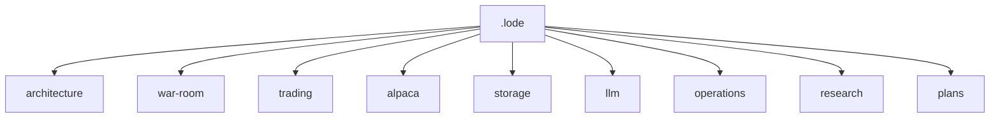

# Lode Map

Read this index before you inspect the code.



## Authority

```text
code > measured evidence > current ADRs > archived AVD
```

The root `alpaca-autonomous-options-agent-avd.md` is an archived design input. It does not
describe the current runtime.

## Root

- [Project summary](summary.md) - Current product state and safety contracts.
- [Terminology](terminology.md) - Short domain definitions.
- [Practices](practices.md) - Repository and C# practices.

## Architecture

- [Summary](architecture/summary.md) - Goals, containers, and boundaries.
- [System context](architecture/system-context.md) - Actors and trust boundary.
- [Component model](architecture/component-model.md) - Current components.
- [Application structure](architecture/application-structure.md) - Current folders.
- [Technology stack](architecture/technology-stack.md) - Current technology choices.
- [Decisions](architecture/decisions.md) - Current architecture decisions.

## War room and LLM

- [War-room summary](war-room/summary.md) - Proposal, review, discussion, and vote.
- [Staged context](war-room/staged-context.md) - Payload stages and proposal versions.
- [LLM summary](llm/summary.md) - Model call and cost contracts.
- [Tool policy](llm/tool-policy.md) - Read-only tool boundary.

## Trading and Alpaca

- [Trading summary](trading/summary.md) - Live-only loop overview.
- [Live cycle](trading/live-cycle.md) - Ordered cycle contract.
- [Risk guardrails](trading/risk-guardrails.md) - Hard limits and fail-closed rules.
- [Position lifecycle](trading/position-lifecycle.md) - Open, review, and close behavior.
- [Contract catalog](trading/tradeable-contract-catalog.md) - Mechanical admission.
- [Universe](trading/universe.md) - Allowed symbols.
- [Strategy parameters](trading/strategy-parameters.md) - Agent policy and hard bounds.
- [Alpaca summary](alpaca/summary.md) - SDK and MCP separation.
- [MCP integration](alpaca/mcp-integration.md) - Connection contracts.
- [MCP run modes](alpaca/mcp-run-modes.md) - Local and deployed MCP setup.
- [MCP safety](alpaca/mcp-safety.md) - Forbidden write tools.
- [Market-data policy](alpaca/market-data-policy.md) - Current data rules.

## Storage and operations

- [Storage summary](storage/summary.md) - Durable audit purpose.
- [Schema](storage/schema.md) - Six-table schema and links.
- [Proposal review audit](storage/proposal-review-audit.md) - Sitting evidence contract.
- [Operations summary](operations/summary.md) - Deployment and accounts.
- [Local development](operations/local-development.md) - Commands and services.
- [Observability](operations/observability.md) - Audit inspection.
- [Fault handling](operations/fault-handling.md) - Failure policy.
- [Restart recovery](operations/restart-recovery.md) - Order recovery.
- [Testing strategy](operations/testing-strategy.md) - Current test layers.
- [Competition constraints](operations/competition-constraints.md) - Event rules.

## Research and plans

- [Historical model evidence](research/historical-model-evidence.md) - Retained negative result.
- [Main risks](plans/main-risks.md) - Current risks and controls.
- [ML hypotheses](plans/ml-hypotheses.md) - Rejected model ideas.
- [MVP roadmap](plans/mvp-roadmap.md) - Remaining delivery work.
- [Definition of done](plans/definition-of-done.md) - Current readiness checks.
- [Open strategy questions](plans/open-strategy-questions.md) - Questions for real trades.

## Reading paths

- New session: [summary](summary.md) then [terminology](terminology.md).
- Change execution: [live cycle](trading/live-cycle.md), then
  [risk guardrails](trading/risk-guardrails.md), then [schema](storage/schema.md).
- Change agents: [war room](war-room/summary.md), then [tool policy](llm/tool-policy.md).
- Operate the host: [local development](operations/local-development.md), then
  [observability](operations/observability.md).
