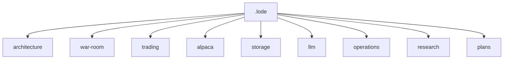

# Lode Map

Read this index before you inspect the code.



## Authority

```text
code > measured evidence > current ADRs > archived AVD
```

The root `alpaca-autonomous-options-agent-avd.md` is an archived design input. It does not
describe the current runtime.

## Root

- [Project summary](summary.md) - Current product state and safety contracts.
- [Terminology](terminology.md) - Short domain definitions.
- [Practices](practices.md) - Repository and C# practices.

## Architecture

- [Summary](architecture/summary.md) - Host, components, boundaries, structure, and technology.
- [Decisions](architecture/decisions.md) - Active decisions with stable identifiers.

## War room and LLM

- [War-room summary](war-room/summary.md) - Proposal, review, discussion, and vote.
- [Votes to verdict](war-room/vote-and-verdict.md) - Tally, thresholds, the approval rule, and
  the rejected hold.
- [LLM summary](llm/summary.md) - Model call, prompt cache, and cost contracts.
- [Call limits](llm/call-limits.md) - Deadline, seat, transport, and retry limits.
- [Persona contracts](llm/persona-contracts.md) - Trust, forecasts, evidence, and voting meaning.

## Trading and Alpaca

- [Trading summary](trading/summary.md) - Live loop, fixed universe, and contract catalog.
- [Live cycle](trading/live-cycle.md) - Ordered cycle contract.
- [Hard-exit loop](trading/hard-exit-loop.md) - Exit timer, broker gate, and order limits.
- [Risk guardrails](trading/risk-guardrails.md) - Hard limits and fail-closed rules.
- [Alpaca summary](alpaca/summary.md) - SDK and MCP separation.
- [MCP integration](alpaca/mcp-integration.md) - Connection, run-mode, and safety contracts.
- [Market-data policy](alpaca/market-data-policy.md) - Current data rules.

## Storage and operations

- [Storage summary](storage/summary.md) - Durable audit purpose.
- [Schema](storage/schema.md) - Eight-table schema, integrity, and evidence links.
- [Operations summary](operations/summary.md) - Deployment, commands, recovery, faults, tests, and the human-facing documents.
- [Local development](operations/local-development.md) - Commands and services.
- [Observability](operations/observability.md) - Audit inspection.
- [Console rendering](operations/console-rendering.md) - Operator view, symbols, and terminal safety.
- [Competition constraints](operations/competition-constraints.md) - Event rules.
- [Presentation](operations/presentation.md) - Submission deck, video script, and their evidence sources.

## Research and plans

- [Research summary](research/summary.md) - Retained negative model result.
- [Session baselines](plans/session-baselines.md) - Measured cost, timing, and results per session.
- [After-session improvements](plans/after-session-improvements.md) - Prioritized live-session repairs.
- [Open strategy questions](plans/open-strategy-questions.md) - Questions for real trades.

## Reading paths

- New session: [summary](summary.md) then [terminology](terminology.md).
- Change execution: [live cycle](trading/live-cycle.md), then
  [risk guardrails](trading/risk-guardrails.md), then [schema](storage/schema.md).
- Change agents: [war room](war-room/summary.md), then
  [votes to verdict](war-room/vote-and-verdict.md), then [LLM summary](llm/summary.md).
- Judge a change: [session baselines](plans/session-baselines.md), then
  [after-session improvements](plans/after-session-improvements.md).
- Operate the host: [local development](operations/local-development.md), then
  [observability](operations/observability.md).

```powershell
Get-Content .lode/lode-map.md, .lode/terminology.md, .lode/summary.md
```

## Related lodes

- [Project summary](summary.md)
- [Terminology](terminology.md)
- [Practices](practices.md)
