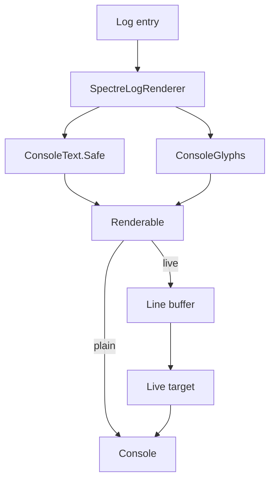

# Console Rendering

`SpectreConsoleLoggerProvider` draws the operator view. `SpectreLogRenderer` turns one log
entry into one renderable. `ConsoleGlyphs` holds every symbol. `ConsoleText` makes untrusted
text safe. This file gives the layout and the terminal-safety rules.



## Layout

An ordinary event draws four fixed columns. The message column takes the width that is left,
so Spectre wraps long text inside it and a wrapped line gets its indent for free.

```text
06:05:14  ·  account    equity 100,000.00 USD · cash 91,250.00 USD · 2 position(s)
06:05:14  ◆  filter     removed 7,994 contract(s)
                        Expires after flatten         3,188
                        Over per trade risk           2,936
06:05:14  ●  quant      analysis → gpt-5.6-terra · 2 messages · 41,208 chars · 1 tools
06:05:14  ✓  quant      analysis 42.3s · 12,208 tokens · 1 tool call(s) [bars]
06:05:14  ▲  order      Buying AMZN260904C00280000 x1 at 2.41 ask.
```

Column widths are `8`, `1`, and `9`, each with two spaces after it. A second row with three
empty cells gives an aligned continuation line for a thesis, a gate count, or an exception.

Four events use a panel: run started (`1001`), run stopped (`1002`), cycle summary (`1005`),
and verdict (`3007`). Cycle start (`1004`) uses a rule. Every other event uses a gutter line.

The war-room events put the seat name in the label column. The symbol and the label carry the
colour. Message text stays plain, because a wall of coloured sentences hides the one line that
matters.

## Terminal safety

**A Windows console starts on an OEM code page.** That encoding has no symbol this view draws,
so .NET uses its best-fit table and replaces each one with a byte the console does hold:

| Symbol | CP437, CP850, CP866 | Result |
|---|---|---|
| `•` | `0x07` | The terminal bell. A beep on almost every line. |
| `▲` | `0x1E` | A control byte. |
| `▼` | `0x1F` | A control byte. |
| `→` | `0x1A` | A control byte. |
| `●` `◆` `✗` | `0x3F` | A question mark. |

Three guards remove this, and each one works alone:

1. `Program` sets `Console.OutputEncoding` to UTF-8 when output is not redirected. UTF-8 has
   no best-fit substitution.
2. `ConsoleGlyphs.For` reads `Profile.Capabilities.Unicode`, which Spectre computes from the
   console encoding, and returns an ASCII set when the console is not Unicode. The borders are
   part of the set: a Spectre *safe* border is still box drawing, so `ConsoleGlyphs` carries
   `BoxBorder.Ascii` and `TableBorder.Ascii` for that console.
3. `ConsoleText.Safe` removes every control character from model, tool, and exception text.

```csharp
public static ConsoleGlyphs For(IAnsiConsole console) =>
    console.Profile.Capabilities.Unicode ? Unicode : Ascii;
```

`ConsoleText.Safe` also folds each run of whitespace into one space, so model prose cannot
break the column layout, and removes format characters, so a bidirectional override cannot
reorder a line. It clips on a Unicode scalar value, so it never keeps half of a surrogate
pair.

## The live display

Spectre restores the cursor over the region it drew last. A line written straight to the
console between two refreshes is erased by the next one. **Nothing writes to the console while
the live display owns it.**

```csharp
await console.Live(_renderer.BuildLiveDisplay())
    .AutoClear(false)
    .Overflow(VerticalOverflow.Crop)
    .Cropping(VerticalOverflowCropping.Top)
    .StartAsync(async context => { /* drain, then UpdateTarget */ });
```

`SpectreLogRenderer.Process` puts each finished renderable in a buffer of 200 lines.
`BuildLiveDisplay` returns the log tail, the active-seat table, and the cycle countdown as one
renderable. It trims the tail to the window height first, because the refresh is periodic and
Spectre crops only after it has drawn everything. `AutoClear` is off, so the last frame is the
record of how the run ended.

The cost is the terminal scrollback: the display repaints one region in place. The plain file
is the complete record.

`DisableLiveDisplay` writes out every buffered line before it reports the fault, so a lost
display loses no event.

## The refresh timer

A model call takes minutes and the session waits half an hour between cycles. A view that
changes only on a log event holds one still picture for all of that, and a live run looks the
same as a hung one.

`RefreshAsync` races the entry channel against a `PeriodicTimer` of 250 ms, built on the
injected `TimeProvider`. Four frames a second reads as motion and costs a quarter of what
Spectre's own progress display spends.

```csharp
var pending = reader.WaitToReadAsync().AsTask();
var tick = ticker.WaitForNextTickAsync().AsTask();
// ... await Task.WhenAny(pending, tick), then replace only the one that completed
```

**Both waits stay outside the loop.** A `PeriodicTimer` allows one outstanding
`WaitForNextTickAsync`. A second request while an abandoned one is still pending throws.

`SpectreLogRenderer.HasLiveWork` is true while a seat waits for a model or a cycle wait is
pending. The loop still wakes on the timer when it is false, but it draws nothing. An idle
wake-up costs a timer callback; only the drawing is worth avoiding.

`AdvanceSpinner` moves the frame, and the live loop is the only caller. `BuildLiveDisplay` has
no side effect, so a test can build the same picture as often as it likes.

## What moves

| Element | Source | Shape |
|---|---|---|
| Seat spinner | `ConsoleGlyphs.Frame(tick)` | `⠹ ⠸ ⠼ ⠴ ⠦ ⠧ ⠇ ⠏`, or `-` `\` `\|` `/` |
| Seat elapsed | now minus `ActiveModelCall.StartedAt` | `m:ss`, then `h:mm:ss` past an hour |
| Cycle countdown | resume instant minus now | `28:14 left · resumes 15:09:35 UTC` |

Event `1006` sets the countdown and event `1004` clears it, because a cycle start ends the wait
whatever the countdown still says. A negative duration prints as zero: the countdown reaches
zero before the session wakes.

The static view has no timer. It states the wait once, on one line, and draws no spinner.

A finished call reports `12.5s` under a minute and `7:24` at or above one, so a long call ends
in the same units the seat table counted it up in.

## Invariants

- Every symbol comes from `ConsoleGlyphs`, the spinner frames included. A literal in a renderer
  is a defect.
- The live view repaints on a timer only while `HasLiveWork` is true.
- `BuildLiveDisplay` has no side effect. Only the live loop advances the spinner.
- Every model, tool, or exception string passes `ConsoleText.Safe` before it is drawn.
- No control character reaches the terminal.
- A console that is not Unicode receives only ASCII.
- Each renderable closes its own line. A second newline gives a blank line between events.
- Nothing writes to the console while the live display is active.
- A render that throws still reports the event through the fallback line.
- Console rendering failure does not change a trade or an audit result.

## Related lodes

- [Observability](observability.md)
- [Local development](local-development.md)
- [Operations summary](summary.md)
