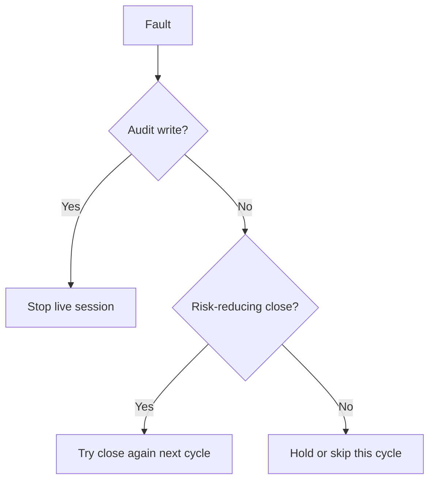

# Fault Handling

The system distinguishes a safe market-data or model failure from loss of durable evidence.
Ordinary cycle faults fail closed and can retry later. Audit persistence faults stop the
session.



| Fault | Behavior |
|---|---|
| Missing or invalid quote | Exclude the contract. |
| Agent failure | Store a hold and skip new positions. |
| Reviewer failure | Count a fault or hold the position. |
| Broker open rejection | Store broker status and do not count an opening. |
| Uncertain buy submit | Keep the reservation and risk. Do not replay it. |
| Uncertain close submit | Reconcile, then retry the same sell and client ID. |
| Rejected or canceled close | Keep the position open and allow a later mandatory retry. |
| Any audit write failure | Throw `AuditPersistenceException` and stop. |
| Pre-close audit failure | Attempt the risk-reducing close once, then stop. |

```csharp
catch (AuditPersistenceException)
{
    throw;
}
```

Catch blocks in the agent, trading loop, and live session preserve this exception. They must
not convert it into a normal model fault.

## Invariants

- No failed data read opens a position.
- No audit failure allows the session to continue.
- A missing audit row is never treated as a warning.
- A close failure does not open or increase risk.

## Related lodes

- [Risk guardrails](../trading/risk-guardrails.md)
- [Proposal review audit](../storage/proposal-review-audit.md)
- [Restart recovery](restart-recovery.md)
- [Observability](observability.md)
