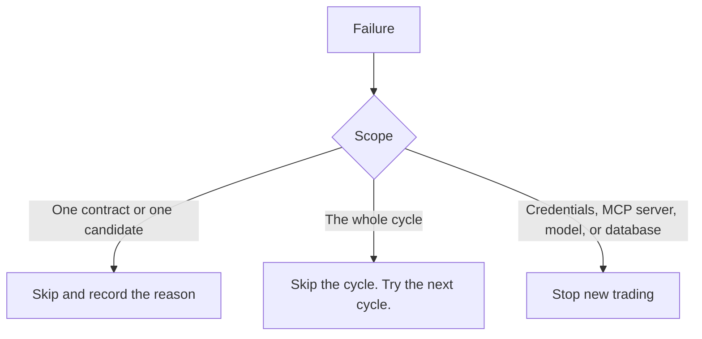

# Fault Handling

Every failure has one required behavior. The general rule is
[fail closed](../trading/risk-guardrails.md).

| Failure | Required behavior |
|---|---|
| An Alpaca MCP server cannot start | Stop trading and show the error. |
| An Alpaca MCP server exits during a session | Stop new trading. Try to restart the child process. |
| Alpaca MCP returns an authentication error | Stop trading. |
| Alpaca MCP returns a rate limit or server error | Respect the retry result. Skip the cycle if the data is still unavailable. |
| An MCP call passes its timeout | Skip the candidate or the cycle, by the scope of the call. |
| A required MCP tool is missing at startup | Stop startup. This is an integration failure. |
| An MCP tool schema is incompatible | Stop startup. This is an integration failure. |
| The read-only connection exposes a trading tool | Stop startup. This is a safety failure. |
| LLM request fails | Skip the candidate. |
| Research Agent returns invalid JSON | Skip the candidate. |
| Critic Agent returns invalid JSON | Skip the candidate. |
| ML model cannot load | Stop new trading. Position-management safety can continue if possible. |
| SQLite write fails | Stop new trading. |
| Option quote is stale or invalid | Skip the contract. |
| Order result is uncertain | Query by `client_order_id` before any retry. |
| Process restarts | Rebuild the account state from Alpaca. |
| Internet connection fails | Do not open new trades. Retry later. |

## Three severity levels

1. **Skip the candidate** — an LLM, quote, or contract problem. Record the reason. Continue
   the cycle.
2. **Skip the cycle** — a rate limit or a temporary data problem. Try again at the next
   cycle.
3. **Stop new trading** — a credential, MCP server, model, or database problem. Existing
   position management can continue if it is safe.

Notice that a failure never opens a position. There is no "assume it is fine" path.

## Timeouts and retries

Apply a timeout to every MCP call. The Alpaca MCP server handles the Alpaca API retry
behavior. **Do not add a second aggressive retry layer on top of it.** Let the server retry,
then skip the cycle.

A dead child process is not a retry case. It is a **stop new trading** event. The host can
try to restart the child process once, then it must confirm the tool list again.

## Recording

A skip is data. Write the reason to `decisions.reason` or to `evaluation_runs.status`. A
demo that shows why the agent did **not** trade is as strong as one that shows a trade.

## Related

- [MCP safety](../alpaca/mcp-safety.md)
- [Restart and recovery](restart-recovery.md)
- [Testing strategy](testing-strategy.md)
