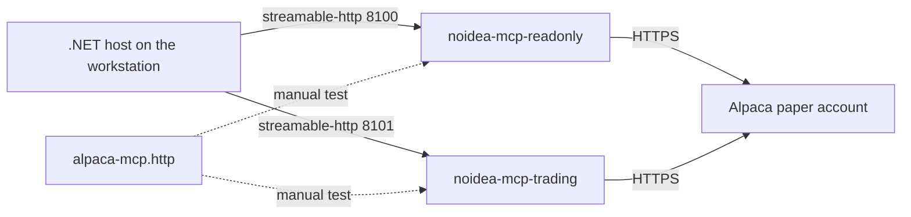

# Local Development

How to run the two Alpaca MCP servers on the developer workstation.

The human-facing version of this file is `DEVELOPMENT.md` in the repository root. Keep the
two files in agreement.

## The development loop

The MCP servers stay up between debug runs. The .NET host starts and stops many times, but
the servers keep running. This is different from the deployed mode, where the host owns the
server processes. See [MCP integration](../alpaca/mcp-integration.md).



## Start

```bash
cp .env.example .env          # then add the development paper account keys
docker compose -f compose.dev.yaml up -d --build
docker compose -f compose.dev.yaml ps       # both must report healthy
```

**The `-f compose.dev.yaml` flag is necessary.** Docker Compose finds only `compose.yaml`,
`compose.yml`, `docker-compose.yaml`, and `docker-compose.yml` by itself. Without the flag
the command stops with `no configuration file provided: not found`.

`restart: unless-stopped` starts the servers again after a reboot of the workstation.

| Service | Port | `ALPACA_TOOLSETS` |
|---|---|---|
| `noidea-mcp-readonly` | `127.0.0.1:8100` | `assets,stock-data,options-data,news,corporate-actions` |
| `noidea-mcp-trading` | `127.0.0.1:8101` | `account,trading,assets` |

**The servers bind to `127.0.0.1` only.** They have no authentication, and the trading
server can place orders. Never publish these ports to `0.0.0.0`.

## The endpoint

- The path is `/mcp`. A request to `/mcp/` gets a `307` redirect to `/mcp`.
- `Accept` must contain `application/json, text/event-stream`.
- `initialize` returns the header `mcp-session-id`. Each later request must send it back in
  the header `Mcp-Session-Id`.
- The response body is a `text/event-stream`. The JSON is on the `data:` line.

```bash
curl -s -D - -o /dev/null -X POST http://127.0.0.1:8100/mcp \
  -H "Content-Type: application/json" \
  -H "Accept: application/json, text/event-stream" \
  -d '{"jsonrpc":"2.0","id":1,"method":"initialize","params":{"protocolVersion":"2025-06-18","capabilities":{},"clientInfo":{"name":"probe","version":"0.1"}}}'
```

## Manual tests

`alpaca-mcp.http` in the repository root holds the full sequence for both servers:
`initialize`, `notifications/initialized`, `tools/list`, and example `tools/call` requests.
Visual Studio Code reads the session id from the response by itself. Visual Studio cannot
chain responses, so paste the `mcp-session-id` value into the manual variables at the top.

The most important request in that file is `tools/list` against port 8100. It proves the
read-only guarantee. See [MCP safety](../alpaca/mcp-safety.md).

## The image

`docker/alpaca-mcp.dev.Dockerfile` builds the pinned submodule and serves it over
`streamable-http`. `docker/mcp-healthcheck.py` is the container healthcheck: any HTTP answer
proves that the server listens, because a bare `GET /mcp` correctly returns an error.

The build context for every image is the **repository root**, because the images need
`external/alpaca-mcp-server/`.

## Credentials

`.env` holds `ALPACA_API_KEY`, `ALPACA_SECRET_KEY`, and `ALPACA_PAPER_TRADE=true`. The file
is git-ignored. Use the **development** paper account here, not the official competition
account. See [operations summary](summary.md).

## Related

- [MCP integration](../alpaca/mcp-integration.md)
- [MCP safety](../alpaca/mcp-safety.md)
- [Application structure](../architecture/application-structure.md)
- [Fault handling](fault-handling.md)
