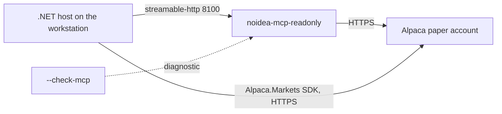

# Local Development

How to run the Alpaca MCP server on the developer workstation.

The human-facing version of this file is `DEVELOPMENT.md` in the repository root. Keep the
two files in agreement.

## The development loop

The MCP server stays up between debug runs. The .NET host starts and stops many times, but
the server keeps running. This is different from the deployed mode, where the host owns the
server process. See [MCP integration](../alpaca/mcp-integration.md).

**There is one server, and it is read-only.** Deterministic C# reaches Alpaca through the
typed `Alpaca.Markets` SDK, so nothing consumed the trading server and it was deleted
(ADR-001, ADR-012). No MCP server this host runs holds an order tool at all.



## Start

```bash
cp .env.example .env          # then add the Alpaca and model keys
docker compose -f compose.dev.yaml up -d --build
docker compose -f compose.dev.yaml ps       # must report healthy
```

**The `-f compose.dev.yaml` flag is necessary.** Docker Compose finds only `compose.yaml`,
`compose.yml`, `docker-compose.yaml`, and `docker-compose.yml` by itself. Without the flag
the command stops with `no configuration file provided: not found`.

`restart: unless-stopped` starts the server again after a reboot of the workstation.

| Service | Port | `ALPACA_TOOLSETS` |
|---|---|---|
| `noidea-mcp-readonly` | `127.0.0.1:8100` | `assets,stock-data,options-data,news,corporate-actions` |

**The server binds to `127.0.0.1` only** and has no authentication. Never publish the port to
`0.0.0.0`.

## Keys

`.env` holds the Alpaca paper keys and **three** model keys. The room seats its four models
on three providers on purpose (ADR-020), so one key is not enough:

| Variable | Seats |
|---|---|
| `ANTHROPIC_API_KEY` | `proposer`, `skeptic` |
| `OPENAI_API_KEY` | `quant` |
| `XAI_API_KEY` | `market` (Grok 4.6) |

`KEENABLE_API_KEY` is optional. Without it, the host logs a warning and gives the seats no
web-search tools. A missing required model key stops LLM-mode startup.

`ChatClientFactory.MissingKeys` fails startup and names what is missing. A seat without a key
is a dead seat, so the failure belongs before the open. `--agent stub` needs none of them.

The standard profile uses Claude Sonnet 5, GPT-5.6-terra, and Grok 4.6. `--cheap` selects
Claude Haiku 4.5 and GPT-5.4-nano. It keeps Grok 4.6.

```powershell
dotnet run --project src/Xakpc.Alpaca.NøIdea -- --live --dry-run --cheap
```

## Between sessions

```powershell
dotnet run --project src/Xakpc.Alpaca.NøIdea -- --recover-sittings
dotnet run --project src/Xakpc.Alpaca.NøIdea -- --audit --last 20
```

`--recover-sittings` opens the database read-write and gives every sitting a stopped process
left open the `abandoned` status. It prints each proposal ID before it writes. Run it only when
no live host is running, then confirm with `--audit`, which must exit zero.

A full sitting can also be rehearsed out of hours. This reads live data, runs the room, and
sends no order:

```powershell
dotnet run --project src/Xakpc.Alpaca.NøIdea -- --live --dry-run --once --allow-stale-quotes
```

`--once` runs one cycle and ignores the market clock. It starts **no hard-exit loop**, so it is
a rehearsal only and never a way to hold a position.

## Operator view

`--live` starts the live display. It repaints one region in place, so the terminal keeps no
scrollback for the run, and it animates while a seat waits for a model or the session waits for
the next cycle. Every other operation prints a static stream, and so does redirected output.
See [console rendering](console-rendering.md).

## The endpoint

- The path is `/mcp`. A request to `/mcp/` gets a `307` redirect to `/mcp`.
- `Accept` must contain `application/json, text/event-stream`.
- `initialize` returns the header `mcp-session-id`. Each later request must send it back in
  the header `Mcp-Session-Id`.
- The response body is a `text/event-stream`. The JSON is on the `data:` line.

```bash
curl -s -D - -o /dev/null -X POST http://127.0.0.1:8100/mcp \
  -H "Content-Type: application/json" \
  -H "Accept: application/json, text/event-stream" \
  -d '{"jsonrpc":"2.0","id":1,"method":"initialize","params":{"protocolVersion":"2025-06-18","capabilities":{},"clientInfo":{"name":"probe","version":"0.1"}}}'
```

## Manual tests

`Program.cs` routes each command explicitly. The direct MCP and order smoke harness runs only
inside the `--check-mcp` or `--smoke` branch. It is not an implicit fall-through after the
live branch.

```csharp
if (args.Contains("--smoke") || args.Contains("--check-mcp"))
{
    // Direct diagnostic harness.
}
```

The repository has no `alpaca-mcp.http` file. Use the host diagnostic to connect, list every
tool, reject forbidden tools, and print the approved count:

```powershell
dotnet run --project src/Xakpc.Alpaca.NøIdea -- --check-mcp
```

`--smoke` is different. It can submit a real paper option buy. It then cancels an unfilled
order or closes a fill. Use it only when a paper-account mutation is intended.

## The image

`docker/alpaca-mcp.dev.Dockerfile` builds the pinned submodule and serves it over
`streamable-http`. `docker/mcp-healthcheck.py` is the container healthcheck: any HTTP answer
proves that the server listens, because a bare `GET /mcp` correctly returns an error.

The build context for every image is the **repository root**, because the images need
`external/alpaca-mcp-server/`.

## Credentials

`.env` is git-ignored and holds `ALPACA_API_KEY`, `ALPACA_SECRET_KEY`,
`ALPACA_PAPER_TRADE=true`, and the three model keys above. Use the **development** paper
account here, not the official competition account. See [operations summary](summary.md).

## Related

- [MCP integration](../alpaca/mcp-integration.md)
- [Architecture summary](../architecture/summary.md)
- [Operations summary](summary.md)
- [Observability](observability.md)
