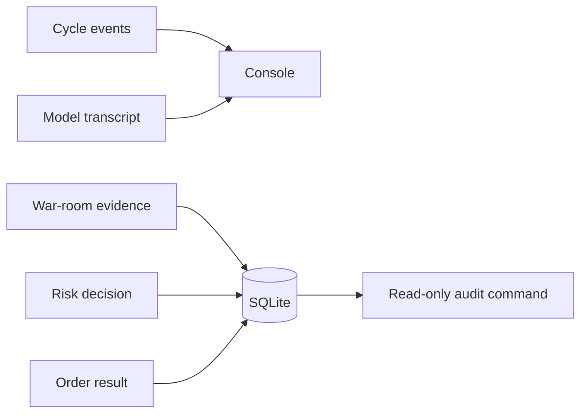

# Observability

The console is the live operator view. SQLite is the durable evidence. Both use stable event
identifiers or correlation identifiers where a later investigation needs a join.



## Operator commands

```powershell
dotnet run --project src/Xakpc.Alpaca.NøIdea -- --audit
dotnet run --project src/Xakpc.Alpaca.NøIdea -- --audit --last 50
```

The command prints row counts and recent decisions. It then checks relational and completion
invariants. It does not create or change the database.

## Durable questions

| Question | Evidence |
|---|---|
| What did the room judge? | `proposal_review_passes.operation_json` |
| What did each reviewer say? | Analysis, discussion, and vote JSON in the review pass. |
| Which external data did a model request? | `agent_tool_calls.arguments_json` |
| What did that tool return? | `agent_tool_calls.result_json` |
| Why did the system hold or reject? | `decision_events.reason` and `risk_result` |
| Which decision authorized an order? | `orders.audit_event_id` |
| What did the broker return? | `orders.alpaca_order_id` and `status` |
| What was account value? | `equity_snapshots` |

## Invariants

- The console minimum level stays at `Information`.
- Full model transcripts stay in the console.
- Tool requests and results also stay in SQLite.
- Audit integrity faults produce a nonzero process result.
- Secrets do not enter prompts, transcripts, or audit JSON.

## Related lodes

- [Schema](../storage/schema.md)
- [Proposal review audit](../storage/proposal-review-audit.md)
- [Fault handling](fault-handling.md)
- [LLM summary](../llm/summary.md)
