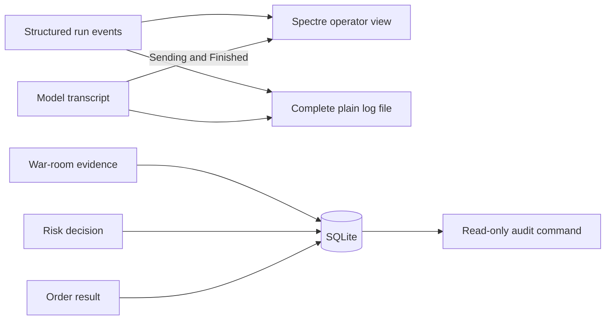

# Observability

The console is the live operator view. SQLite is the durable evidence. Both use stable event
identifiers or correlation identifiers where a later investigation needs a join.

Events in the `1000` block cover the run and the cycle. `1006` is the wait between cycles: the
session is idle for half an hour by default, and without that event the console shows nothing
at all for that time.



## Operator commands

```powershell
dotnet run --project src/Xakpc.Alpaca.NøIdea -- --audit
dotnet run --project src/Xakpc.Alpaca.NøIdea -- --audit --last 50
```

The command prints row counts and recent decisions. It then checks relational and completion
invariants. It does not create or change the database. Normal process startup still creates
a timestamped plain log file.

## Console and file split

`SpectreConsoleLoggerProvider` owns the operator view. It reads the event identifier and the
structured log values. It does not parse the formatted message. Events in the `1000` block
show the run and cycle. Events in the `2000` block show account, catalog, risk, and order
data. Events in the `3000` block show the war room. Unknown events use a compact level line.

```csharp
builder.AddProvider(fileLoggerProvider);
builder.AddProvider(new SpectreConsoleLoggerProvider(args.Contains("--live")));
```

The plain file is the complete investigation record. The console is a curated live view.
The console does not show information-level prompts, model prose, tool arguments, or tool
results. The file still shows them. A warning or error always reaches the console.

Only `--live` starts the live display. `--smoke`, `--check-mcp`, `--audit`, and any redirected
or non-ANSI output print a static stream instead.

For the layout, the symbol sets, and the terminal-safety rules, see
[console rendering](console-rendering.md).

## Model-conversation event identifiers

The file prints each kind of step in a conversation between a seat and its model. The
identifier is `4000 + (seat block * 100) + kind`. A seat block is permanent. The last digit
is always the same kind, so `41xx` selects the proposer and `xxx3` selects a tool call from
any seat.

| Kind | Last digit | File | Console |
|---|---|---|---|
| `Request` | 1 | Clipped prompt and payload. | Hidden at information level. |
| `Said` | 2 | Model prose and reasoning. | Hidden at information level. |
| `ToolCall` | 3 | Tool name and arguments. | Hidden at information level. |
| `ToolResult` | 4 | Tool answer. | Hidden at information level. |
| `Finished` | 5 | Finish reason and usage. | Compact completion line. |
| `Sending` | 6 | Full call summary. | Active task-table row. |

Seat blocks: proposer 1, quant 2, skeptic 3, market 4, exposure 5, unknown seat 9.

`Sending` adds one row for the seat and phase before the host waits. Concurrent seats own
independent rows. `Finished` removes the matching row and prints the duration, token total,
and tool tally. A cycle end clears all rows, so a seat that stops without a `Finished` event
cannot hold a row for the rest of the run. Each row shows a spinner and how long the seat has
waited, and the live view repaints four times a second while any row is present. See
[console rendering](console-rendering.md).

```text
quant [vote] asks gpt-5.6-terra for PR-4831. Sending 2 messages, 41,208 characters,
1 tools [cast_vote]; must call cast_vote, max 1500 output tokens, temperature 0.40.
Sent at 14:32:11Z. Waiting for the answer.
```

The line is separate from `Request` because a prompt dump can be tens of kilobytes. The start
time stays visible in the task table. The plain file also adds its own timestamp.

## Catalog filter report

Event `2007` reports why the catalog has the size it has. The loop counts each removed
contract against the first gate that refused it. `EventCountBreakdown` keeps typed counts.
The console prints one aligned row for each gate under the event line. Its text form keeps the
plain file easy to search:

```text
info: Trader[2002] 0 candidate(s) from 13 symbol(s).
info: Trader[2007] Dropped 7994 of 7994 contract(s): expires-after-flatten 3188,
      over-per-trade-risk 2936, quote-too-old 802, spread-too-wide 668, quote-not-two-sided 400.
```

The group name is the `RiskVerdict.Code` of the gate. A symbol that gives no price and a
symbol that gives no chain are counted in a separate line, because one entry there is a
symbol and not a contract. An empty catalog stops the cycle before the room sits, so this
line is the only record of the cause.

## Durable questions

| Question | Evidence |
|---|---|
| What did the room judge? | `proposal_review_passes.operation_json` |
| What did each reviewer say? | Analysis, discussion, and vote JSON in the review pass. |
| Which external data did a model request? | `agent_tool_calls.arguments_json` |
| What did that tool return? | `agent_tool_calls.result_json` |
| Why did the system hold or reject? | `decision_events.reason` and `risk_result` |
| Which decision authorized an order? | `orders.audit_event_id` |
| What did the broker return? | `orders.alpaca_order_id` and `status` |
| What was account value? | `equity_snapshots` |

## Invariants

- The console minimum level stays at `Information`.
- The console is curated. The plain file is complete.
- No control character reaches the terminal. See [console rendering](console-rendering.md).
- A seat writes the `Sending` line before each model call. The line names the seat, the phase,
  the model, the proposal, the payload size, the toolbox, the tool mode, the output-token
  limit, the temperature, and the send time.
- An event identifier and a seat block do not change. A new number makes each existing filter
  go quiet, and nothing reports the change.
- A cycle that removes a contract reports the count for each gate under event `2007`.
- Model messages are clipped at 4,000 characters. Tool answers are clipped at 2,000
  characters.
- Each process writes the complete clipped record to `data/logs/trader-YYYYMMDD-HHMMSS.log`.
- The live view repaints on a timer only while a model call or a cycle wait is running. An
  idle live view repaints on a log event alone.
- The session announces every wait between cycles under event `1006`.
- Console rendering failure does not change a trade or an audit result.
- Nothing writes to the console while the live display owns it.
- Tool requests and results also stay in SQLite.
- Audit integrity faults produce a nonzero process result.
- Secrets do not enter prompts, transcripts, or audit JSON.

## Related lodes

- [Console rendering](console-rendering.md)
- [Schema](../storage/schema.md)
- [Operations summary](summary.md)
- [LLM summary](../llm/summary.md)
