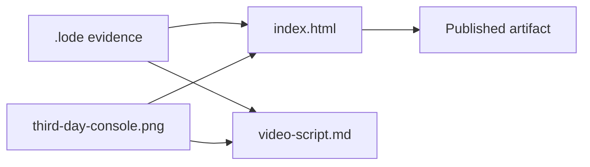

# Presentation Deliverables

The competition submission material lives in `presentation/`. It is not part of the host and no
code reads it. This file records what each artifact claims, where each number comes from, and
the framing decision behind the result slides.



## Files

| File | Purpose |
|---|---|
| `index.html` | Eleven-slide deck. One self-contained file, no build step and no local assets. |
| `video-script.md` | 60-second voiceover script: four beats, cue sheet, recording notes, and a clean full transcript. Half the runtime is one real sitting cut to 30 seconds, start to NO_TRADE. |
| `third-day-console.png` | Operator console at run complete, cropped to the window. Embedded in the deck as a base64 data URI. |
| `third-day.png` | The original uncropped capture. Kept as the source. |
| `Pavel Osadchuk, resume 2026.pdf` | Source for the author and ask slides. Not embedded. |

The public repository is `https://github.com/xakpc/Alpaca.NoIdea`, linked from the title and
closing slides. `presentation/` is gitignored, so the deck and the script are not in it.

The published copy is at `https://claude.ai/code/artifact/3981f3c5-75e0-4e79-8923-6a02f5720da5`.
It is generated from `index.html` by removing the standalone document wrapper, because the host
supplies its own. Change `index.html` first, then regenerate:

```bash
sed -E '/^<!doctype html>$/d; /^<html lang="en">$/d; /^<\/?head>$/d; /^<meta /d; /^<\/?body>$/d; /^<\/html>$/d' index.html > deck-artifact.html
```

## Deck contract

- Two readers: competition judges, and Alpaca as an employer. The author applied for Staff
  Software Engineer, New Markets (Remote), and the deck is the work sample.
- **The deck answers the published rubric; it does not argue with it.** The four criteria are
  P&L performance, technology implementation, creativity and originality, and presentation and
  execution. The Alpaca surface slide exists for the technology criterion. No slide tells a
  judge how to weight a criterion.
- **Every figure must have a lode source.** The deck states no number that
  [session baselines](../plans/session-baselines.md), [risk guardrails](../trading/risk-guardrails.md),
  [war-room summary](../war-room/summary.md), or [research summary](../research/summary.md)
  does not support.
- **The P&L is stated, not led with.** Two days of paper trading is not a track record and the
  deck says so in its own voice. The claim it does make is which part of the system produced
  the result: the deterministic exit, the fresh quote at the gate, and the cost of a delayed
  close.
- **The database is not in the repo.** `data/` is gitignored, so no `.db` file is tracked.
  `data/trader.db` is written by the run and read by `--audit`. Do not write that the audit
  database ships with the repository.
- **The defect list is shown, not hidden.** The history slide carries the refused universe,
  the buying silence, and the rejected hold that did nothing.
- The premise slide is the design rationale: the author cannot judge an options trade, so
  domain judgement is delegated to models and permission stays in deterministic code.

## Deck mechanics

One `<section>` per slide inside a scroll-snap container. Keys: arrows, Space, PgUp, PgDn,
Home, End, digits `1`-`9` and `0`, `P` to print, `?` for help. The location hash tracks the
current slide, so a single slide can be linked. `?export=N` renders slide N alone, full-bleed
and without chrome, for per-slide capture. The print stylesheet gives one landscape page per
slide, so `Ctrl+P` produces the PDF; there is no export script.

Colors are the Alpaca palette: `#FFD928` accent, `#0E0E0E` ink, `#F7F7F3` ground, `#EEEEEA`
rules, `#6B6B68` secondary. Slides 1, 5, 7, and 10 invert to the near-black ground. The deck
commits to one visual world and does not follow the viewer theme. Type is Archivo with IBM Plex
Mono for every measured figure.

## Related lodes

- [Operations summary](summary.md)
- [Competition constraints](competition-constraints.md)
- [Session baselines](../plans/session-baselines.md)
- [Console rendering](console-rendering.md)
