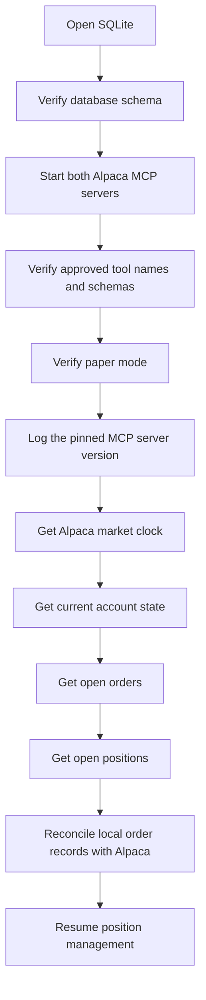

# Restart and Recovery

The application must be restart-safe. A restart during an open position must not lose money
or duplicate an order.

## Startup sequence

1. Open SQLite.
2. Verify the database schema.
3. Start the read-only Alpaca MCP server and the trading Alpaca MCP server.
4. Call `ListToolsAsync()` on both. Validate the required tool names and schemas. **Fail
   startup if a required tool is missing, if a schema changed, or if the read-only
   connection exposes a trading tool.**
5. Verify paper mode with an account read. **Fail startup if paper mode cannot be
   confirmed.**
6. Log the pinned MCP server version and the approved tool names.
7. Get the Alpaca market clock.
8. Get the current account state.
9. Get the open orders.
10. Get the open positions.
11. Reconcile the local order records with Alpaca.
12. Resume position management.

## The reconciliation rule

**The application must not assume that SQLite has the latest position state.** Alpaca is the
source of truth for the current account.

Reconciliation compares the `orders` rows with the Alpaca order list. It matches by
`client_order_id`. An `orders` row without a matching Alpaca order can mean:

- The submit never reached Alpaca. The row stays open for the idempotency check.
- The order filled and closed while the process was down. Update the row from Alpaca.

## The uncertain order

If a submit failed with an uncertain network result, query the order by `client_order_id`
**before** any new submit. The `UNIQUE` constraint on `client_order_id` is the second
defence. See [risk guardrails](../trading/risk-guardrails.md).

## Test requirement

A failure test must restart the process while a position is open and confirm recovery. It must also restart an MCP server
during a session and confirm recovery. This is Phase 8 in the [MVP roadmap](../plans/mvp-roadmap.md).

## Related

- [Fault handling](fault-handling.md)
- [Storage schema](../storage/schema.md)
