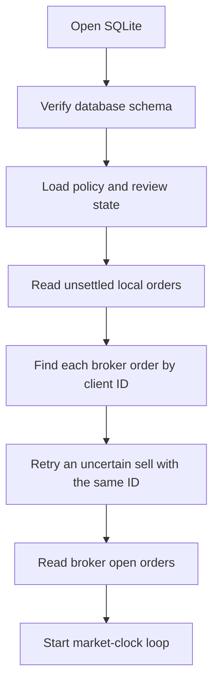

# Restart and Recovery

```csharp
var brokerOrder = await trading.FindOrderByClientIdAsync(clientOrderId, cancellationToken);
```

The application restores its safety state before the first live cycle. Alpaca stays the
source of truth for positions and broker order state.

## Startup sequence



1. Open SQLite and require schema version `3`.
2. Load the active policy and review cursors for the run mode.
3. Read each non-terminal local order.
4. Query Alpaca with its `client_order_id`.
5. Store the current lifecycle and linked decision outcome.
6. Read all broker open orders and merge them with unresolved local orders.
7. Enter the market-clock loop. A transient startup fault retries on the next session pass.

## The reconciliation rule

**The application must not assume that SQLite has the latest position state.** Alpaca is the
source of truth for the current account.

`OrderCoordinator` matches orders by `client_order_id`. It updates the canonical lifecycle,
raw broker status, fill quantity, average fill price, and reconciliation time. A pending sell
also prevents a new mandatory or war-room close for the same option.

## The uncertain order

An uncertain buy stays quarantined. Its full stored limit risk remains pending, and the host
does not replay it. An uncertain sell reduces risk, so the host can replay the stored market
sell with the same client ID. It does not create a new ID while the first order is unresolved.

```csharp
await trading.SubmitOrderAsync(storedSellRequest, cancellationToken);
```

The daily loss baseline comes from Alpaca `LastEquity`. The daily open count comes from buy
orders with fills during the current US market day. Policy and review cursors come from
SQLite. These values do not reset when the process restarts.

## Test requirement

Tests cover uncertain buy quarantine, same-ID sell replay, terminal lifecycle reconciliation,
durable policy and review cursors, and duplicate-close suppression.

## Related

- [Fault handling](fault-handling.md)
- [Storage schema](../storage/schema.md)
