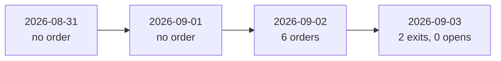

# Session Results

The measured numbers that a change is judged against. One row is one live process. Use these
values when you estimate cost, sitting time, or how much evidence a session produces. This file
holds evidence only. Open work is in [improvements](../plans/improvements.md).

Every live session ran from the debug profile, not from the compiled defaults: `--rounds 1
--new-trade-approve-threshold -0.15 --cycle-minutes 20`. The defaults are 2 rounds, a threshold
of 0, and a 30-minute cycle. A number below therefore describes one round of discussion and a
20-minute cycle.

## All sessions

| Session | Cycles | Sittings | Orders | Model calls | Cost | End equity |
|---|---:|---:|---:|---:|---:|---:|
| 2026-08-31 | 3 | 3 | 0 | 21 | 4.6095 | 100,000.00 |
| 2026-09-01 | 4 | 4 | 0 | 52 | 5.6665 | 100,000.00 |
| 2026-09-02 14:10-16:08 | 4 | - | 4 | 44 | 6.8235 | - |
| 2026-09-02 16:11-20:02 | 9 | - | 2 | 77 | 9.3829 | 100,199.84 |
| 2026-09-03 dry runs | 3 | 4 | 0 | 50 | 4.6248 | - |
| 2026-09-03 14:33-15:47 | 5 | 0 | 2 closes | 5 | 0.0000 | 101,274.64 |
| 2026-09-03 16:05-20:12 | 9 | 7 | 0 | 79 | 10.2400 | 101,274.64 |

The two 2026-09-02 processes held 13 sittings together. The account moved from 100,000.00 to
101,274.64 across the competition. Total model spend was about 41 USD of real money.

## The last day: 2026-09-03

The competition flatten is 19:30 UTC on this day. The market opened at 13:30 UTC. The first
process of the day started at 14:33 UTC, so two positions carried from 2026-09-02 stayed
unmanaged for 63 minutes. **The exit loop lives inside the process. No process is no stop.**

The hard-exit loop then closed both positions at 14:33:29 UTC with no model in the path:

| Position | Reason | Change |
|---|---|---:|
| `META260904C00582500` | take profit | +114% |
| `MSFT260904P00500000` | stop loss | -92% |

Equity moved from 100,199.84 to 101,274.64. That is the whole result of the last day.

### The room made no trade

Two of four seats failed on every call from 16:05 UTC to the close: `HTTP 429
(insufficient_quota: credit_balance_exhausted)`, 42 times. `RequireEveryVoter` makes one faulted
seat an outright rejection, so no proposal could be approved after the first failed call.

| Cycle | Contract | Verdict |
|---|---|---|
| 1 | `QQQ260904C00712500` | 1 approve, 0 reject, 1 abstain, 2 faulted |
| 2 | `TSLA260904C00375000` | 1 approve, 0 reject, 1 abstain, 2 faulted |
| 3 | `SPY260904C00770000` | 1 approve, 0 reject, 1 abstain, 2 faulted |
| 4 | `INTC260904C00090000` | 1 approve, 0 reject, 1 abstain, 2 faulted |
| 5 | `NVDA260904C00227500` | 0 approve, 0 reject, 2 abstain, 2 faulted |
| 6 | `AMZN260904C00257500` | 1 approve, 0 reject, 1 abstain, 2 faulted |
| 7 | `QQQ260904C00715000` | 0 approve, 0 reject, 1 abstain, 3 faulted |
| 8, 9 | none | proposer returned `NO_TRADE` after the flatten instant |

Each row is stored with the code `ROOM_VOTE`, which reads as a decision of the room. The true
cause is a quorum that could not be met. Do not score these seven rows as refusals.

Cycle 7 also lost the skeptic twice with `Status Code: BadRequest`. That fault has no known
cause and no retry.

### Four cycles were lost before that

Between 14:33 and 15:47 UTC the proposer failed five times: three times with `Service request
failed` and twice at the 9-minute call limit. Each failure was recorded as `Hold - the proposer
found no trade` with `0 rejected` and a cost of `0.0000 USD`. In the audit these cycles cannot
be told apart from a deliberate refusal.

### What each seat cost on 2026-09-03

| Seat | Model | Calls | Tokens | Cost |
|---|---|---:|---:|---:|
| skeptic | claude-sonnet-5 | 21 | 3,978,109 | 7.2535 |
| proposer | grok-4.6 | 16 | 2,868,818 | 2.9865 |
| quant | gpt-5.6-terra | 21 | 0 | 0.0000 |
| market | gpt-5.6-terra | 21 | 0 | 0.0000 |

**A zero is not a saving.** The quant and market rows are 42 failed calls. `TokenLedger` reads
its numbers from a response, and a failed call has none.

## The first trading day: 2026-09-02

| Item | 14:10-16:08 UTC | 16:11-20:02 UTC |
|---|---|---|
| Opens | 3 (NVDA, GOOGL, MSFT) | 1 (META) |
| Closes | 1 (NVDA, take profit) | 1 (GOOGL, room vote) |
| Tokens | 4,201,813 | 5,824,097 |
| End state | stopped by the operator | stopped at the market close |

| Seat | Model | Calls | Tokens | Cost | Cache hit |
|---|---|---:|---:|---:|---:|
| skeptic | claude-sonnet-5 | 21 | 2,155,698 | 4.8993 | 0 percent |
| proposer | grok-4.6 | 14 | 1,456,860 | 1.9071 | 48 percent |
| market | gpt-5.6-terra | 21 | 1,442,246 | 1.6010 | 59 percent |
| quant | gpt-5.6-terra | 21 | 769,293 | 0.9755 | 59 percent |

The skeptic was 52 percent of that run's cost and had no cache. That measurement produced the
cache contract in [LLM summary](../llm/summary.md).

## Sitting cost and duration

A complete sitting costs 0.80 to 2.09 USD and 11 model calls. One cycle with a position review
and a new-trade sitting used 17.5 of its 20 minutes. The worst case measured:

| Phase | Duration |
|---|---|
| Position review, complete sitting | 7:29 |
| New-trade sitting, complete | 9:27 |

A single dry-run sitting is the timing reference: 8:30 in total, 3:59 to propose, 1:20 for the
parallel analysis, 2:21 for one discussion round, 0:48 to rebut, 8 calls, 0.7346 USD.

## Results that the evidence supports

**The deterministic exits produced every dollar.** NVDA on 2026-09-02 was bought at 4.59 and
sold at plus 54 percent. META on 2026-09-03 was sold at plus 114 percent. No model was in either
path, and no session has yet produced a profit that came from a war-room open.

**The fresh quote at the gate saved 150 USD.** The room debated META at an ask of 15.42. The
gate read the quote again and the fill was 13.92. The stale number never authorised money.

**A delayed close costs money.** The room proposed a GOOGL close at a bid of 4.90 and rejected
it on a net of 0.00. The same close was approved two hours later near a bid of 4.43.

**A refusal can be a fault.** On 2026-09-01 four unanimous rejections came from a reviewer
standard that refused the whole eligible universe. On 2026-09-03 seven rejections came from two
dead seats. Neither is a judgement about a contract.

## Related lodes

- [Improvements](../plans/improvements.md)
- [Operations summary](summary.md)
- [War-room summary](../war-room/summary.md)
- [LLM summary](../llm/summary.md)
- [Hard-exit loop](../trading/hard-exit-loop.md)
