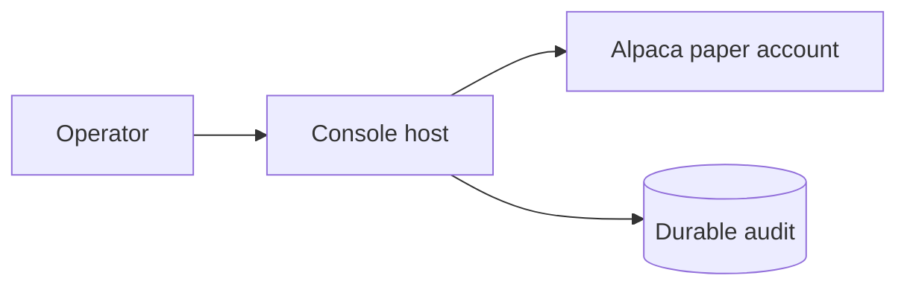
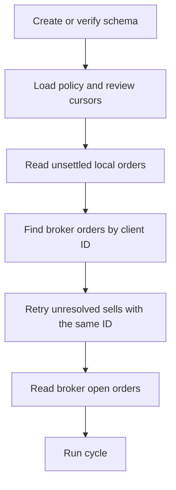

# Operations



```powershell
dotnet run --project src/Xakpc.Alpaca.NøIdea -- --audit
```

How the system starts, runs, fails, and gets tested.

## Deployment

The system does not run through a closed market. A normal live session stops when the Alpaca
clock reports that the market is closed. The operator starts a new process for the next
market session. This rule prevents an unattended process from spending model tokens tomorrow.

```csharp
if (!clock.IsOpen)
{
    break;
}
```

The operator starts the program. **After startup the system does not require trade
approval.**

The deployed image holds the .NET host and the pinned Alpaca MCP server. The host starts one
read-only `stdio` child inside its own container. The deployment needs no Docker socket and
no second container.

Development uses one permanent read-only MCP container over streamable HTTP on
`127.0.0.1:8100`. Keenable is a separate external HTTPS MCP service. See
[local development](local-development.md) and [Alpaca integration](../alpaca/mcp-integration.md).

## Submission

A **hosted application is not required.** The agent runs autonomously and only places
orders, so a GitHub repository is a sufficient submission. A hosted link is needed only for
a demo application that the judges must open. Per
[KISS and YAGNI](../practices.md), do not build one.

The repository can stay private during the hackathon.

Pre-event infrastructure, boilerplate, and existing libraries can be reused. **Pre-event
work used in the submission must be disclosed.** The submission must also state the use of
the free Indicative options feed.

## Accounts

Use two paper accounts:

| Account | Use |
|---|---|
| Development paper account | All integration tests and all rehearsal trades. |
| Official $100,000 paper account | The competition window only. No development trades. |

The Alpaca MCP server and typed SDK receive the selected paper-account credentials. The SDK
clients are fixed to `Environments.Paper`.

## Commands and effects

| Command | Current effect |
|---|---|
| `--live` | Run the live market-clock loop and permit paper orders. |
| `--live --dry-run` | Use live reads, write audit evidence, and intercept broker writes. |
| `--audit` | Open SQLite read-only, print evidence, and return nonzero for integrity faults. |
| `--recover-sittings` | Give every sitting a stopped process left open the `abandoned` status. |
| `--check-mcp` | Connect, list, and validate read-only Alpaca MCP tools. |
| `--smoke` | Submit a paper option buy, then cancel it or close a fill. This changes the paper account. |

Each process creates a timestamped plain log file before command routing. Therefore the audit
command does not change SQLite, but it does create a log file.

## Startup and recovery



Live startup calls `CreateSchemaAsync`. It does not call `AuditIntegrityAsync`. A sitting that a
stopped process left open stays `running` until `--recover-sittings` marks it `abandoned`. Run
that command, then `--audit`, between sessions. Do not run it while a live host is up.

Alpaca is the source of truth for positions and broker orders. The host restores policy and
position-review cursors from SQLite. It reconciles unsettled orders by client ID. An uncertain
buy is quarantined. An unresolved sell can be replayed with the same client ID.

Prior-close equity normally comes from Alpaca. Its safe fallback is process-local and does not
survive restart.

## Fault behavior

| Fault | Result |
|---|---|
| Missing or invalid market data | Exclude the row or hold new risk. |
| Agent failure | Record a hold when possible and skip new risk. |
| Required reviewer failure | Reject the proposal because quorum fails. |
| Uncertain buy | Keep its reservation and risk; do not replay it. |
| Uncertain sell | Reconcile and retry the same risk-reducing request. |
| Audit persistence failure | Throw `AuditPersistenceException` and stop the session. |
| Pre-close audit failure | Attempt one risk-reducing close, then stop. |

## Verification

```powershell
dotnet test Xakpc.Alpaca.NøIdea.slnx --no-restore --nologo
dotnet run --project src/Xakpc.Alpaca.NøIdea -- --audit --last 50
```

The deterministic suite currently has 104 passing tests. The present `trader.db` is not
audit-clean because earlier interrupted dry runs left incomplete sittings. Do not describe an
older clean audit as the current database state.

## Related

- [Competition constraints](competition-constraints.md)
- [Local development](local-development.md)
- [Observability](observability.md)
- [Storage schema](../storage/schema.md)
- [After-session improvements](../plans/after-session-improvements.md)
